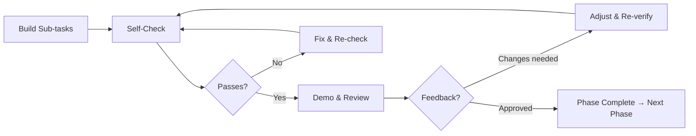
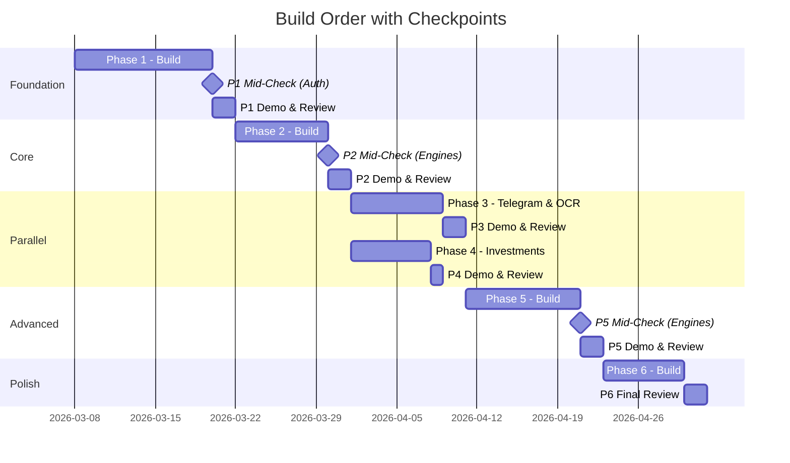

# Finance Tracking Dashboard — Build Plan

> Derived from `finance_tracking_dashboard_plan_v2.md`. Each task is granular, actionable, and references specific files, routes, tables, and components.

---

## Checking & Feedback Loop Process

Every phase follows a structured **Build → Verify → Review → Adjust** cycle. This ensures nothing ships broken, misaligned with the plan, or without stakeholder awareness.

### The Loop (Per Phase)



### 1. Self-Check (After Every Sub-Section)

After completing each numbered sub-section (e.g. 1.2, 1.3, 2.1), run the following before moving on:

| Check | How | Pass Criteria |
|-------|-----|---------------|
| **TypeScript compiles** | `npm run typecheck` | Zero errors |
| **Lint passes** | `npm run lint` | Zero errors (warnings acceptable if pre-existing) |
| **Build passes** | `npm run build` | Clean production build |
| **Unit tests pass** (if applicable) | `npm test` or `npx vitest run` | All tests green |
| **Manual smoke test** | Start dev server, navigate to affected pages | No console errors, UI renders correctly, interactions work |
| **Schema validation** | Run migrations against Supabase, check types generate | Migrations apply cleanly, types match schema |

**If any check fails:** Fix immediately before proceeding. Do not accumulate tech debt across sub-sections.

### 2. Phase Gate (End of Each Phase)

Before declaring a phase complete, run the full **Phase Acceptance Criteria** checklist (defined at the end of each phase below). Every item must pass. Additionally:

| Gate Step | Detail |
|-----------|--------|
| **Full test suite** | Run all unit + integration tests end to end |
| **Cross-section integration** | Verify data flows correctly between sub-sections built in this phase (e.g., onboarding saves data → dashboard reads it) |
| **Regression check** | Re-test key flows from previous phases to ensure nothing broke |
| **Code quality review** | Review new files for: consistent patterns, proper error handling, Zod validation on all inputs, TypeScript strict compliance, no `any` types |
| **Accessibility spot-check** | Tab navigation works, ARIA labels on interactive elements, sufficient color contrast |
| **Screenshot / recording** | Capture the current state of all new UI sections (for review artifact and rollback reference) |

### 3. Demo & Review Checkpoint (End of Each Phase)

Each phase ends with a structured review before the next phase begins:

| Step | Action | Output |
|------|--------|--------|
| **Demo prep** | Record a short walkthrough video of all new functionality | `.mp4` artifact |
| **Changelog** | Write a brief summary: what was built, what works, what's known-incomplete | Markdown notes in PR/commit |
| **Stakeholder review** | Present the demo + changelog for feedback | Approval or change requests |
| **Feedback triage** | Categorize feedback as: **blocker** (fix now), **adjust** (fix in this phase), **defer** (add to later phase), **out of scope** (park in backlog) | Triaged list |
| **Adjustment sprint** | Implement blocker + adjust items, re-run self-check | Updated code passes all checks |
| **Phase sign-off** | Confirm all acceptance criteria met + feedback addressed | ✅ Move to next phase |

### 4. Mid-Phase Checkpoints (For Phases with >15 Tasks)

Phases 1, 2, and 5 are large enough to warrant a **mid-phase checkpoint** — a lighter version of the phase gate run at the halfway mark:

| Phase | Mid-Phase Checkpoint After | Focus |
|-------|---------------------------|-------|
| **Phase 1** | After 1.3 (Auth complete) | Auth flow end-to-end: login → OTP → session → middleware redirect. DB schema applied + types generated. |
| **Phase 2** | After 2.1 (Calculation engines) | All 6 calculators pass unit tests with known Singapore examples. No UI yet — pure logic validation. |
| **Phase 5** | After 5.1–5.3 (All engines) | Tax, insurance, loan calculation engines all pass unit tests. Verified against real-world Singapore scenarios. |

At each mid-phase checkpoint: run self-check, review test results, and do a quick demo of what works so far. Fix any issues before building UI on top of potentially incorrect logic.

### 5. Cross-Phase Regression Protocol

After completing Phase N and before starting Phase N+1:

1. **Smoke test all previous phases** — navigate through every major flow (login → onboarding → dashboard → each section) to verify nothing regressed.
2. **Run full test suite** — all unit tests from all phases must still pass.
3. **Check data integrity** — verify data written by Phase N is readable by Phase N-1 components (e.g., Telegram-written cashflow appears correctly on the dashboard).
4. **Performance sanity check** — page load times should not have degraded noticeably. Flag if any page takes >3s to render in dev.

### 6. Feedback Channels

| Channel | When | Format |
|---------|------|--------|
| **PR review** | On every commit/push | Code diff + description |
| **Phase demo video** | End of each phase | Screen recording of all new features |
| **Issue tracker** | Ongoing | Bugs, feedback items, deferred requests |
| **Quick async check-in** | After each mid-phase checkpoint | Brief message: "Phase 1 mid-checkpoint: auth works end-to-end. Moving to onboarding. Any concerns?" |

### Feedback Response SLA

| Priority | Definition | Response Time |
|----------|-----------|---------------|
| **Blocker** | Fundamental misalignment with plan, broken core flow, data corruption | Fix before any new work |
| **Adjust** | UX improvement, calculation tweak, layout change within current phase scope | Fix within current phase before gate |
| **Defer** | Nice-to-have, future phase scope, non-critical enhancement | Log in backlog, assign to appropriate phase |
| **Out of scope** | Beyond v2 plan, feature creep | Park in backlog, discuss at project level |

---

## Codebase Starting Point

```
/workspace
├── app/
│   ├── globals.css          # Tailwind + shadcn CSS variables (stone base)
│   ├── layout.tsx           # Root layout (DM Sans + Geist Mono, ThemeProvider)
│   └── page.tsx             # Placeholder "Project ready!" page
├── components/
│   ├── theme-provider.tsx   # next-themes with 'd' hotkey toggle
│   └── ui/button.tsx        # shadcn Button (radix-nova style)
├── hooks/                   # Empty (.gitkeep)
├── lib/utils.ts             # cn() helper (clsx + tailwind-merge)
├── public/                  # Empty (.gitkeep)
├── components.json          # shadcn v4 config (radix-nova, stone, lucide, RSC)
├── next.config.mjs          # Empty config
├── tsconfig.json            # TypeScript strict, bundler resolution, path aliases
├── eslint.config.mjs        # ESLint next/core-web-vitals + next/typescript
├── postcss.config.mjs       # @tailwindcss/postcss
└── package.json             # Next.js 16, React 19, shadcn/ui, Tailwind 4
```

**Tech:** Next.js 16.1.6 (Turbopack), React 19, Tailwind CSS 4, shadcn/ui v4 (radix-nova), TypeScript 5.9

**Conventions established:**
- Path alias `@/*` maps to root
- shadcn components go in `components/ui/`
- Hooks go in `hooks/`
- Utilities go in `lib/`
- RSC by default; `"use client"` only where needed

---

## Phase 1 — Foundation

**Goal:** Supabase backend, auth (Telegram OTP), onboarding flow, dashboard shell with side nav, tooltip system.

### 1.1 Project Configuration & Dependencies

| # | Task | Detail |
|---|------|--------|
| 1.1.1 | Install Supabase client | `npm install @supabase/supabase-js` |
| 1.1.2 | Install Telegram bot library | `npm install telegraf` (preferred over node-telegram-bot-api — better TypeScript support, middleware pattern) |
| 1.1.3 | Install additional shadcn components | Via `npx shadcn@latest add`: `input`, `label`, `card`, `dialog`, `tooltip`, `hover-card`, `progress`, `separator`, `tabs`, `select`, `switch`, `badge`, `avatar`, `dropdown-menu`, `sheet`, `sidebar`, `skeleton`, `toast`, `sonner` |
| 1.1.4 | Install utility packages | `npm install zod` (validation), `npm install jose` (JWT for sessions), `npm install date-fns` (date math for CPF/loans) |
| 1.1.5 | Create `.env.local` template | Create `.env.local` with required env vars (see below) |
| 1.1.6 | Add `.env.local` to `.gitignore` | Ensure secrets are never committed |
| 1.1.7 | Configure `.cursor/mcp.json` | Add shadcn + Supabase MCP servers per v2 plan section 8a |
| 1.1.8 | Add `mcp.json` to `.gitignore` | Per v2 plan note — may contain Supabase access token |

**`.env.local`:**
```
# Supabase (required)
NEXT_PUBLIC_SUPABASE_URL=
NEXT_PUBLIC_SUPABASE_PUBLISHABLE_DEFAULT_KEY=
```

### 1.2 Supabase Project & Schema

| # | Task | Detail |
|---|------|--------|
| 1.2.1 | Create Supabase project | Via Supabase dashboard or CLI (`npx supabase init`, `npx supabase start` for local dev) |
| 1.2.2 | Create Supabase client helper | `lib/supabase/client.ts` — browser client using `NEXT_PUBLIC_SUPABASE_URL` + `NEXT_PUBLIC_SUPABASE_PUBLISHABLE_DEFAULT_KEY` |
| 1.2.3 | Create Supabase server helper | `lib/supabase/server.ts` — server client using `SUPABASE_SERVICE_ROLE_KEY` for API routes |
| 1.2.4 | Create migration: `households` table | See schema below |
| 1.2.5 | Create migration: `profiles` table | See schema below |
| 1.2.6 | Create migration: `otp_tokens` table | For Telegram OTP auth |
| 1.2.7 | Create migration: `sessions` table | JWT session tracking |
| 1.2.8 | Create migration: `bank_accounts` table | |
| 1.2.9 | Create migration: `monthly_cashflow` table | |
| 1.2.10 | Create migration: `bank_balance_snapshots` table | |
| 1.2.11 | Create migration: `savings_goals` table | |
| 1.2.12 | Create migration: `goal_contributions` table | |
| 1.2.13 | Create migration: `investments` table | |
| 1.2.14 | Create migration: `investment_transactions` table | |
| 1.2.15 | Create migration: `ilp_products` table | |
| 1.2.16 | Create migration: `ilp_entries` table | |
| 1.2.17 | Create migration: `cpf_balances` table | |
| 1.2.18 | Create migration: `cpf_housing_usage` table | |
| 1.2.19 | Create migration: `income_config` table | |
| 1.2.20 | Create migration: `tax_entries` table | |
| 1.2.21 | Create migration: `tax_relief_inputs` table | |
| 1.2.22 | Create migration: `tax_relief_auto` table | |
| 1.2.23 | Create migration: `loans` table | |
| 1.2.24 | Create migration: `loan_repayments` table | |
| 1.2.25 | Create migration: `loan_early_repayments` table | |
| 1.2.26 | Create migration: `insurance_policies` table | |
| 1.2.27 | Create migration: `insurance_coverage_benchmarks` table | |
| 1.2.28 | Create migration: `insurance_premium_schedule` table | |
| 1.2.29 | Create migration: `prompt_schedule` table | |
| 1.2.30 | Create migration: `bank_account_ocbc360_config` table | |
| 1.2.31 | Create migration: `ocr_uploads` table | |
| 1.2.32 | Create migration: `telegram_commands` table | |
| 1.2.33 | Create migration: `precious_metals_prices` table | |
| 1.2.34 | Enable RLS on all tables | Household-scoped policies: users can only access rows belonging to their household |
| 1.2.35 | Create RLS policies | `household_id` check on all tables (via profiles → households chain) |
| 1.2.36 | Generate TypeScript types | `npx supabase gen types typescript --project-id <id> > lib/supabase/database.types.ts` |

**Key Table Schemas (SQL):**

```sql
-- households
CREATE TABLE households (
  id UUID PRIMARY KEY DEFAULT gen_random_uuid(),
  user_count INT NOT NULL DEFAULT 2 CHECK (user_count >= 1 AND user_count <= 6),
  telegram_chat_id TEXT,
  telegram_bot_token TEXT,
  onboarding_completed_at TIMESTAMPTZ,
  created_at TIMESTAMPTZ DEFAULT now()
);

-- profiles
CREATE TABLE profiles (
  id UUID PRIMARY KEY DEFAULT gen_random_uuid(),
  household_id UUID NOT NULL REFERENCES households(id) ON DELETE CASCADE,
  name TEXT NOT NULL,
  telegram_user_id TEXT,
  birth_year INT NOT NULL CHECK (birth_year >= 1940 AND birth_year <= 2010),
  created_at TIMESTAMPTZ DEFAULT now(),
  UNIQUE (household_id, name)
);

-- otp_tokens
CREATE TABLE otp_tokens (
  id UUID PRIMARY KEY DEFAULT gen_random_uuid(),
  household_id UUID NOT NULL REFERENCES households(id) ON DELETE CASCADE,
  otp_hash TEXT NOT NULL,
  expires_at TIMESTAMPTZ NOT NULL,
  used BOOLEAN DEFAULT false,
  ip_address INET,
  created_at TIMESTAMPTZ DEFAULT now()
);

-- income_config
CREATE TABLE income_config (
  id UUID PRIMARY KEY DEFAULT gen_random_uuid(),
  profile_id UUID NOT NULL REFERENCES profiles(id) ON DELETE CASCADE,
  annual_salary NUMERIC(12,2) NOT NULL,
  bonus_estimate NUMERIC(12,2) DEFAULT 0,
  pay_frequency TEXT NOT NULL DEFAULT 'monthly' CHECK (pay_frequency IN ('monthly', 'bi-monthly', 'weekly')),
  employee_cpf_rate NUMERIC(5,4),  -- auto-calculated from birth_year
  updated_at TIMESTAMPTZ DEFAULT now(),
  UNIQUE (profile_id)
);

-- bank_accounts
CREATE TABLE bank_accounts (
  id UUID PRIMARY KEY DEFAULT gen_random_uuid(),
  household_id UUID NOT NULL REFERENCES households(id) ON DELETE CASCADE,
  profile_id UUID REFERENCES profiles(id) ON DELETE SET NULL,  -- null = combined/shared
  bank_name TEXT NOT NULL,
  account_type TEXT NOT NULL DEFAULT 'basic' CHECK (account_type IN ('ocbc_360', 'basic', 'savings', 'fixed_deposit')),
  interest_rate_pct NUMERIC(5,4),  -- for non-360 accounts
  opening_balance NUMERIC(14,2) DEFAULT 0,  -- manual seed for first month
  created_at TIMESTAMPTZ DEFAULT now()
);

-- monthly_cashflow
CREATE TABLE monthly_cashflow (
  id UUID PRIMARY KEY DEFAULT gen_random_uuid(),
  profile_id UUID NOT NULL REFERENCES profiles(id) ON DELETE CASCADE,
  month DATE NOT NULL,  -- first day of month (e.g. 2026-03-01)
  inflow NUMERIC(14,2) DEFAULT 0,
  outflow NUMERIC(14,2) DEFAULT 0,  -- discretionary outflow only
  source TEXT DEFAULT 'manual' CHECK (source IN ('manual', 'telegram', 'ocr')),
  created_at TIMESTAMPTZ DEFAULT now(),
  updated_at TIMESTAMPTZ DEFAULT now(),
  UNIQUE (profile_id, month)
);

-- cpf_balances
CREATE TABLE cpf_balances (
  id UUID PRIMARY KEY DEFAULT gen_random_uuid(),
  profile_id UUID NOT NULL REFERENCES profiles(id) ON DELETE CASCADE,
  month DATE NOT NULL,
  oa NUMERIC(14,2) DEFAULT 0,
  sa NUMERIC(14,2) DEFAULT 0,
  ma NUMERIC(14,2) DEFAULT 0,
  is_manual_override BOOLEAN DEFAULT false,
  created_at TIMESTAMPTZ DEFAULT now(),
  UNIQUE (profile_id, month)
);

-- investments
CREATE TABLE investments (
  id UUID PRIMARY KEY DEFAULT gen_random_uuid(),
  household_id UUID NOT NULL REFERENCES households(id) ON DELETE CASCADE,
  profile_id UUID REFERENCES profiles(id) ON DELETE SET NULL,  -- null = combined
  type TEXT NOT NULL CHECK (type IN ('stock', 'gold', 'silver', 'ilp', 'etf', 'bond')),
  symbol TEXT NOT NULL,
  units NUMERIC(14,6) DEFAULT 0,
  cost_basis NUMERIC(14,2) DEFAULT 0,
  created_at TIMESTAMPTZ DEFAULT now()
);

-- insurance_policies
CREATE TABLE insurance_policies (
  id UUID PRIMARY KEY DEFAULT gen_random_uuid(),
  profile_id UUID NOT NULL REFERENCES profiles(id) ON DELETE CASCADE,
  name TEXT NOT NULL,
  type TEXT NOT NULL CHECK (type IN ('term_life', 'whole_life', 'integrated_shield', 'critical_illness', 'endowment', 'ilp', 'personal_accident')),
  premium_amount NUMERIC(10,2) NOT NULL,
  frequency TEXT NOT NULL DEFAULT 'yearly' CHECK (frequency IN ('monthly', 'yearly')),
  yearly_outflow_date INT CHECK (yearly_outflow_date >= 1 AND yearly_outflow_date <= 12),
  coverage_amount NUMERIC(14,2),
  coverage_type TEXT CHECK (coverage_type IN ('death', 'critical_illness', 'hospitalization', 'disability', 'personal_accident')),
  is_active BOOLEAN DEFAULT true,
  deduct_from_outflow BOOLEAN DEFAULT true,
  created_at TIMESTAMPTZ DEFAULT now()
);

-- loans
CREATE TABLE loans (
  id UUID PRIMARY KEY DEFAULT gen_random_uuid(),
  profile_id UUID NOT NULL REFERENCES profiles(id) ON DELETE CASCADE,
  name TEXT NOT NULL,
  type TEXT NOT NULL CHECK (type IN ('housing', 'personal', 'car', 'education')),
  principal NUMERIC(14,2) NOT NULL,
  rate_pct NUMERIC(5,4) NOT NULL,
  tenure_months INT NOT NULL,
  start_date DATE NOT NULL,
  lender TEXT,
  use_cpf_oa BOOLEAN DEFAULT false,
  created_at TIMESTAMPTZ DEFAULT now()
);
```

### 1.3 Authentication (Telegram OTP)

| # | Task | Detail |
|---|------|--------|
| 1.3.1 | Create `app/login/page.tsx` | Login page with "Enter Household ID" + "Request OTP" button + "Enter OTP" input |
| 1.3.2 | Create `app/api/auth/request-otp/route.ts` | POST: receives household_id, generates 6-digit OTP, hashes with SHA-256, stores in `otp_tokens` (expires 5 min), sends OTP to Telegram via bot API. Rate limit: 3 per 15 min per IP. |
| 1.3.3 | Create `lib/telegram/bot.ts` | Telegraf bot instance singleton. `sendMessage(chatId, text)` helper. |
| 1.3.4 | Create `app/api/auth/verify-otp/route.ts` | POST: receives household_id + otp_code, hash and compare with stored OTP, check expiry, mark as used, issue JWT session cookie (HttpOnly, Secure, SameSite=Lax, 7-day expiry). |
| 1.3.5 | Create `lib/auth/session.ts` | `createSession(householdId)`, `validateSession(request)`, `destroySession()` using `jose` for JWT signing/verification with `SUPABASE_SERVICE_ROLE_KEY` as secret. |
| 1.3.6 | Create `middleware.ts` | Next.js middleware: check session cookie on all `/dashboard/*`, `/settings/*`, `/onboarding/*` routes. Redirect to `/login` if invalid. Redirect to `/onboarding` if `onboarding_completed_at` is null. |
| 1.3.7 | Create `app/api/auth/logout/route.ts` | POST: clear session cookie, redirect to `/login` |

### 1.4 Onboarding Flow

| # | Task | Detail |
|---|------|--------|
| 1.4.1 | Create `app/onboarding/layout.tsx` | Minimal layout with progress bar component. No side nav. |
| 1.4.2 | Create `components/onboarding/progress-bar.tsx` | "Step X of 8" with visual progress segments |
| 1.4.3 | Create `app/onboarding/page.tsx` | Step 1: Welcome — intro text, "Get Started" button → step 2 |
| 1.4.4 | Create `app/onboarding/users/page.tsx` | Step 2: How many users? — number selector (1–6), "Next" saves to `households.user_count` |
| 1.4.5 | Create `app/onboarding/profiles/page.tsx` | Step 3: Profiles — dynamically render N forms (name + birth_year) based on `user_count`. Save to `profiles`. Tooltip on birth_year ("Used for CPF age band calculation"). |
| 1.4.6 | Create `app/onboarding/income/page.tsx` | Step 4: Income — per profile: annual_salary, bonus_estimate, pay_frequency. "Skip" link to defer. Save to `income_config`. Tooltip: "Income drives CPF projection. Net pay = gross − employee CPF." |
| 1.4.7 | Create `app/onboarding/banks/page.tsx` | Step 5: Bank accounts — add ≥1 bank (bank_name dropdown, account_type radio). If OCBC selected → show sub-step 5a. Save to `bank_accounts`. |
| 1.4.8 | Create `components/onboarding/ocbc-goals-step.tsx` | Step 5a: Conditional OCBC Goals — goal name, target amount, current amount. Multiple goals. "Skip" link. Save to `savings_goals`. |
| 1.4.9 | Create `app/onboarding/telegram/page.tsx` | Step 6: Telegram setup — chat ID input, 3 method accordions (chatIDrobot, web extract, message link), bot token verification. "Test Connection" button sends test message. Save to `households.telegram_chat_id`. |
| 1.4.10 | Create `app/api/telegram/test-connection/route.ts` | POST: receives chat_id, sends "✅ Connected to fdb-tracker" via bot, returns success/failure |
| 1.4.11 | Create `app/onboarding/reminders/page.tsx` | Step 7: Prompt schedule — per prompt type: frequency (yearly/monthly), day, time, timezone dropdown. Save to `prompt_schedule`. |
| 1.4.12 | Create `app/onboarding/complete/page.tsx` | Step 8: Summary of configured items, "Go to Dashboard" CTA. On click: set `households.onboarding_completed_at = now()`, redirect to `/dashboard`. |
| 1.4.13 | Create `app/api/onboarding/[step]/route.ts` | POST/PUT per step: validate with Zod, save to respective table, return next step URL |
| 1.4.14 | Create Zod schemas for onboarding | `lib/validations/onboarding.ts` — schemas for each step's inputs |

### 1.5 Dashboard Shell & Navigation

| # | Task | Detail |
|---|------|--------|
| 1.5.1 | Create `app/dashboard/layout.tsx` | Dashboard layout with collapsible side nav + main content area. Use shadcn `Sidebar` component. |
| 1.5.2 | Create `components/layout/sidebar-nav.tsx` | Side nav with two top-level groups: **Dashboard** (with sub-items: Overview, Banks, CPF, Cashflow, Investments, Goals, Loans, Insurance, Tax) and **Settings** (with sub-items: General, User Settings, Notifications, Setup). Use `lucide-react` icons. Active state highlighting. |
| 1.5.3 | Create `components/layout/header.tsx` | Top bar: household name, combined/individual toggle tabs, user avatar/name dropdown (profile switch, logout). |
| 1.5.4 | Create `components/layout/profile-toggle.tsx` | Tabs: `Combined | [User 1] | [User 2] | ...` — reads profiles from context, sets active profile filter. |
| 1.5.5 | Create `hooks/use-active-profile.ts` | React context/hook: stores the currently selected profile_id (or null for combined). Used by all dashboard sections to filter data. |
| 1.5.6 | Create `app/dashboard/page.tsx` | Overview section placeholder — will be built in Phase 2 |
| 1.5.7 | Create placeholder pages for all sections | `app/dashboard/banks/page.tsx`, `app/dashboard/cpf/page.tsx`, `app/dashboard/cashflow/page.tsx`, `app/dashboard/investments/page.tsx`, `app/dashboard/goals/page.tsx`, `app/dashboard/loans/page.tsx`, `app/dashboard/insurance/page.tsx`, `app/dashboard/tax/page.tsx` — each with section title + "Coming soon" placeholder |
| 1.5.8 | Create `app/dashboard/investments/detail/page.tsx` | Investments detail page placeholder (separate route linked from overview) |
| 1.5.9 | Create `app/settings/layout.tsx` | Settings layout with sub-nav |
| 1.5.10 | Create settings placeholder pages | `app/settings/page.tsx` (General), `app/settings/users/page.tsx`, `app/settings/notifications/page.tsx`, `app/settings/setup/page.tsx` |

### 1.6 Tooltip System

| # | Task | Detail |
|---|------|--------|
| 1.6.1 | Create `lib/tooltips.ts` | Central registry: export object keyed by area (e.g. `NET_WORTH`, `SAVINGS_RATE`, `CPF_OA`). Each entry has `logic`, `explanation`, `details` strings. Matches the full tooltip table from v2 plan section 5. |
| 1.6.2 | Create `components/ui/info-tooltip.tsx` | Reusable component: `<InfoTooltip id="NET_WORTH" />` — renders `HelpCircle` icon + shadcn `Tooltip` (short) or `HoverCard` (long). Looks up content from `lib/tooltips.ts`. |
| 1.6.3 | Add all 17 tooltip entries | Populate `lib/tooltips.ts` with all entries from v2 plan tooltip table: Net worth, Liquid net worth, Savings rate, Bank balance, Bank interest (OCBC 360), CPF OA/SA/MA, Insurance deduct, Insurance gap, Tax calculated, Tax relief inputs, Loan interest saved, CPF housing refund, Goal progress, Investment P&L, Gold/Silver value, OCBC 360 Insure/Invest. |

### 1.7 Mid-Phase Checkpoint — After Auth (1.3)

**Trigger:** Before starting onboarding (1.4).

| Check | Action |
|-------|--------|
| `npm run typecheck` | Zero errors |
| `npm run lint` | Zero errors |
| `npm run build` | Clean build |
| DB migrations applied | All tables exist, types generated, RLS enabled |
| Auth end-to-end test | Login → Request OTP → OTP arrives in Telegram → Enter OTP → Session cookie set → Middleware redirects to `/onboarding` |
| Negative auth test | Invalid OTP rejected. Expired OTP rejected. Rate limiting triggers after 3 attempts. |
| Quick async check-in | "Phase 1 mid-checkpoint: auth works end-to-end. DB schema applied. Moving to onboarding. Any concerns?" |

**Fix any issues before proceeding to 1.4.**

### 1.8 Phase 1 Gate — Acceptance Criteria

- [ ] User can visit `/login`, enter household ID, request OTP via Telegram, enter OTP, get session
- [ ] New users redirected to `/onboarding` flow (all 8 steps functional)
- [ ] Onboarding saves data to Supabase (households, profiles, income_config, bank_accounts, savings_goals, prompt_schedule)
- [ ] Telegram test connection sends message to channel
- [ ] After onboarding, user redirected to `/dashboard` with working side nav
- [ ] Combined/individual profile toggle functional
- [ ] Tooltip system renders on hover/click with correct content
- [ ] All routes protected by middleware (redirect to login if no session)
- [ ] All DB tables created with RLS policies
- [ ] TypeScript types generated from schema

### 1.9 Phase 1 Demo & Review

| Step | Action |
|------|--------|
| **Record demo** | Walkthrough: login → OTP → onboarding (all 8 steps) → dashboard shell → profile toggle → tooltips |
| **Write changelog** | List all pages, API routes, DB tables created |
| **Submit for review** | Share demo video + changelog |
| **Triage feedback** | Categorize as blocker / adjust / defer / out of scope |
| **Implement fixes** | Address blockers + adjustments, re-run all checks |
| **Sign off** | All acceptance criteria met + feedback addressed → proceed to Phase 2 |

---

## Phase 2 — Core Data & CPF

**Goal:** Bank accounts, monthly cashflow (with CPF-adjusted inflow), CPF auto-calculation, retirement benchmarking, dashboard Overview/Banks/CPF/Cashflow sections.

### 2.1 Calculation Engines

| # | Task | Detail |
|---|------|--------|
| 2.1.1 | Create `lib/calculations/cpf.ts` | **CPF Contribution Calculator.** Functions: `getCpfRates(age, year)` → returns employee/employer rates and OW ceiling. `calculateCpfContribution(grossSalary, age, year)` → returns { employee, employer, total, oa, sa, ma }. Includes 2025 and 2026 rate tables. Allocation tables for both years. Bonus/AW ceiling logic. |
| 2.1.2 | Create `lib/calculations/take-home.ts` | **Take-Home Pay Calculator.** `calculateTakeHome(annualSalary, bonus, birthYear, year)` → returns { monthlyGross, employeeCpf, monthlyTakeHome, annualTakeHome }. Uses `cpf.ts`. |
| 2.1.3 | Create `lib/calculations/bank-balance.ts` | **Bank Balance Derivation.** `calculateClosingBalance(openingBalance, inflow, discretionaryOutflow, autoDeductions)` → returns closing balance. `getEffectiveOutflow(discretionary, insurancePremiums, ilpPremiums, loanRepayments, taxProvision)` → returns total. |
| 2.1.4 | Create `lib/calculations/bank-interest.ts` | **OCBC 360 Interest Calculator.** `calculateOcbc360Interest(balance, config)` → tiered calculation using all 7 categories. Handles first $75k and next $25k bands. `calculateSimpleInterest(balance, ratePct)` for non-360. |
| 2.1.5 | Create `lib/calculations/cpf-retirement.ts` | **CPF Retirement Benchmarking.** `getRetirementSums(cohortYear)` → { brs, frs, ers, payouts }. `projectCpfGrowth(currentBalances, monthlyContribution, incomeGrowthRate, years)` → monthly projection array with interest (OA 2.5%, SA/MA 4%, extra 1% on first $60k). `calculateRetirementGap(projectedTotal, target)` → gap amount + percentage. |
| 2.1.6 | Create `lib/calculations/outflow.ts` | **Outflow Deduplication Engine.** Aggregates auto-deducted items from insurance_policies, ilp_products, loan_repayments. Separates discretionary from auto. Validates against suspicious totals. |
| 2.1.7 | Write unit tests for all calculators | `__tests__/calculations/cpf.test.ts`, `take-home.test.ts`, `bank-balance.test.ts`, `bank-interest.test.ts`, `cpf-retirement.test.ts`, `outflow.test.ts`. Test with known Singapore examples. |

### 2.2 API Routes — Core Data

| # | Task | Detail |
|---|------|--------|
| 2.2.1 | Create `app/api/cashflow/route.ts` | GET: fetch monthly_cashflow for profile + month range. POST: upsert inflow/outflow for a month. |
| 2.2.2 | Create `app/api/bank-accounts/route.ts` | GET: list bank accounts for household. POST: create. PUT: update. DELETE: remove. |
| 2.2.3 | Create `app/api/bank-balance/route.ts` | GET: compute derived bank balance for account + month (opening + inflow − effective outflow). Returns balance timeline. |
| 2.2.4 | Create `app/api/cpf/balances/route.ts` | GET: fetch CPF balances for profile + month range. POST: manual override. Auto-calculate from income if not overridden. |
| 2.2.5 | Create `app/api/cpf/retirement/route.ts` | GET: returns retirement benchmarks, current progress, projection for profile. |
| 2.2.6 | Create `app/api/income/route.ts` | GET/PUT: income_config for profile. On update, triggers CPF recalculation. |
| 2.2.7 | Create `app/api/overview/route.ts` | GET: aggregated dashboard overview metrics — liquid net worth, total net worth, savings rate, bank total, CPF total, investment total, loan total. |

### 2.3 Dashboard Sections — UI

| # | Task | Detail |
|---|------|--------|
| 2.3.1 | Install charting library | `npm install @visx/axis @visx/shape @visx/scale @visx/group @visx/responsive @visx/sankey @visx/tooltip @visx/grid @visx/legend @visx/curve` (visx) |
| 2.3.2 | Create `components/dashboard/metric-card.tsx` | Reusable card: label, value, trend arrow, tooltip icon. Used for hero metrics and mini cards. |
| 2.3.3 | Create `components/dashboard/section-header.tsx` | Section title + optional description + profile toggle context |
| 2.3.4 | Build `app/dashboard/page.tsx` (Overview) | **Hero metrics:** Total Net Worth (CPF labeled), Liquid Net Worth, Savings Rate. **Mini cards:** Bank total, CPF total, Investments total, Loans outstanding. **Chart:** Net worth trend (line, 12mo). All filtered by active profile. |
| 2.3.5 | Build `app/dashboard/banks/page.tsx` | Per-bank balance cards (derived), OCBC 360 interest projection with category breakdown stacked bar, month-over-month balance change spark chart. |
| 2.3.6 | Create `components/dashboard/ocbc360-interest.tsx` | OCBC 360 interest breakdown component: shows which categories are met (green) vs not (gray), projected monthly interest, balance band visualization. |
| 2.3.7 | Build `app/dashboard/cpf/page.tsx` | **Sub-tabs:** Overview, Housing, Loans, Retirement. |
| 2.3.8 | Create `components/dashboard/cpf/overview-tab.tsx` | OA/SA/MA cards per user, monthly contribution bar chart (stacked OA/SA/MA), growth projection line chart. |
| 2.3.9 | Create `components/dashboard/cpf/housing-tab.tsx` | CPF OA used for housing metrics table, accrued interest calculator, 120% VL remaining, waterfall chart (OA → housing → accrued → refund → remaining). |
| 2.3.10 | Create `components/dashboard/cpf/loans-tab.tsx` | Loans using CPF OA, CPF vs cash comparison, amortization schedule with CPF/cash split. |
| 2.3.11 | Create `components/dashboard/cpf/retirement-tab.tsx` | BRS/FRS/ERS gauge chart, progress bars per user, projection line chart with benchmark lines, gap analysis cards. |
| 2.3.12 | Build `app/dashboard/cashflow/page.tsx` | Monthly inflow vs effective outflow (stacked bar or waterfall). Breakdown: Discretionary \| Insurance \| ILP \| Loans \| Tax. 12-month rolling trend line. |
| 2.3.13 | Create `components/dashboard/cashflow/waterfall-chart.tsx` | Waterfall visualization showing inflow → discretionary → insurance → ILP → loans → tax → remaining. |

### 2.4 Mid-Phase Checkpoint — After Calculation Engines (2.1)

**Trigger:** Before building any dashboard UI (2.2+).

| Check | Action |
|-------|--------|
| All 7 unit test files pass | `npx vitest run __tests__/calculations/` — all green |
| CPF rates verified | Test age 30 ($6,000/mth) → employee CPF = $1,200, OA/SA/MA splits match 2026 allocation table |
| Take-home verified | Test age 30 ($84,000/yr) → monthly take-home = $5,600 (matches v2 plan example) |
| OCBC 360 interest verified | Test $80,000 balance with salary+save met → correct tiered calculation across $75k/$25k bands |
| Retirement projection verified | Test age 30, $6,000/mth → project to 55, verify crosses FRS line at expected age |
| Outflow dedup verified | Test discretionary $3,000 + insurance $200/mth + ILP $500/mth → effective outflow = $3,700, not $3,000 or double-counted |
| Quick async check-in | "Phase 2 mid-checkpoint: all 7 calculation engines pass unit tests. Known Singapore examples verified. Moving to dashboard UI. Any concerns?" |

**Do not build UI on top of unverified calculation logic. Fix all test failures first.**

### 2.5 Phase 2 Gate — Acceptance Criteria

- [ ] CPF calculator produces correct OA/SA/MA splits for all age groups (2025 + 2026 rates)
- [ ] Take-home pay correctly deducts employee CPF from gross salary
- [ ] Bank balance derives correctly from opening + inflow − effective outflow
- [ ] OCBC 360 interest calculates correctly for all category combinations
- [ ] CPF retirement projection shows progress toward BRS/FRS/ERS
- [ ] Dashboard Overview shows all hero metrics and mini cards with real data
- [ ] Banks section shows per-account balances with OCBC 360 breakdown
- [ ] CPF section has 4 sub-tabs, all showing real data
- [ ] Cashflow section shows waterfall breakdown
- [ ] All sections respect profile toggle (Combined / Individual)

### 2.6 Phase 2 Demo & Review

| Step | Action |
|------|--------|
| **Record demo** | Walkthrough: dashboard overview → banks with OCBC 360 breakdown → CPF all 4 sub-tabs → cashflow waterfall. Show profile toggle switching between Combined/Individual. |
| **Calculation evidence** | Include screenshots of unit test results. Show a worked example: input salary → derived CPF → derived take-home → derived bank balance. |
| **Write changelog** | List all calculation engines, API routes, dashboard sections built |
| **Submit for review** | Share demo + calculation evidence + changelog |
| **Triage feedback** | Focus on: are calculations correct? Is the data flow intuitive? Are charts readable? |
| **Implement fixes** | Address feedback, re-run unit tests + visual check |
| **Regression check** | Re-test Phase 1 flows (login → onboarding → redirect to dashboard) |
| **Sign off** | All acceptance criteria met → proceed to Phase 3 |

---

## Phase 3 — Telegram & OCR

**Goal:** Telegram bot with all commands, name-based user identification, PDF → OCR → cashflow, stock image upload, configurable reminders.

### 3.1 Telegram Bot Core

| # | Task | Detail |
|---|------|--------|
| 3.1.1 | Create `lib/telegram/bot.ts` | Telegraf bot instance. Register all command handlers. Export `bot` and `sendMessage` helper. |
| 3.1.2 | Create `lib/telegram/user-resolver.ts` | `resolveUser(name, householdId)` — case-insensitive lookup against `profiles.name`. Returns profile_id or error with known names list. Single-user shortcut: if household has 1 profile, name is optional. |
| 3.1.3 | Create `lib/telegram/command-parser.ts` | Parse structured commands. Extract name, numbers, text. Zod schemas for each command format. |
| 3.1.4 | Create `app/api/telegram/webhook/route.ts` | POST: Telegraf webhook handler. Routes incoming updates to command handlers. |
| 3.1.5 | Set up Telegram webhook | Via Telegram API: `setWebhook({ url: APP_URL/api/telegram/webhook })` |

### 3.2 Telegram Command Handlers

| # | Task | Detail |
|---|------|--------|
| 3.2.1 | `/in [name] [amount]` handler | `lib/telegram/commands/inflow.ts` — resolve user, validate amount, upsert `monthly_cashflow.inflow` for current month. Reply: "✅ [Name] inflow set to $X for [Month]." |
| 3.2.2 | `/out [name] [amount]` handler | `lib/telegram/commands/outflow.ts` — same pattern. Discretionary outflow only. Reply includes deduplication reminder. |
| 3.2.3 | `/buy [name] [symbol] [qty] [price] [journal...]` handler | `lib/telegram/commands/buy.ts` — resolve user, parse args, create `investment_transactions` (type=buy) + update `investments` (add units, update cost_basis). Reply: "✅ [Name] bought [qty] [symbol] @ $[price]." |
| 3.2.4 | `/sell [name] [symbol] [qty] [price] [journal...]` handler | `lib/telegram/commands/sell.ts` — same, type=sell, reduce units. Validate sufficient holdings. |
| 3.2.5 | `/stockimg [name] [symbol] [journal...]` handler | `lib/telegram/commands/stockimg.ts` — detect attached image, upload to Supabase Storage, link `screenshot_url` to most recent transaction for that symbol. Reply: "📸 Screenshot saved for [symbol]." |
| 3.2.6 | `/ilp [name] [product] [value]` handler | `lib/telegram/commands/ilp.ts` — resolve user, find ilp_product by name, upsert `ilp_entries` for current month. Reply: "✅ [Product] fund value set to $X." |
| 3.2.7 | `/goaladd [name] [goal] [amount]` handler | `lib/telegram/commands/goaladd.ts` — resolve user, find savings_goal by name, create `goal_contributions`, update `savings_goals.current_amount`. Reply: "✅ Added $X to [goal]. Progress: Y%." |
| 3.2.8 | `/repay [name] [loan] [amount]` handler | `lib/telegram/commands/repay.ts` — one-time entry. Create `loan_repayments` with amount. System derives principal/interest portions from amortization. Reply: "✅ Repayment of $X logged for [loan]." |
| 3.2.9 | `/earlyrepay [name] [loan] [amount]` handler | `lib/telegram/commands/earlyrepay.ts` — create `loan_early_repayments`. Reply includes interest saved estimate. |
| 3.2.10 | `/confirm` handler | `lib/telegram/commands/confirm.ts` — confirm pending OCR-parsed data. Write to `monthly_cashflow`. |
| 3.2.11 | Audit logging middleware | Telegraf middleware: log every command to `telegram_commands` table (command, args, user, timestamp, success/failure). |

### 3.3 PDF Upload (Manual Entry Required)

| # | Task | Detail |
|---|------|--------|
| 3.3.1 | ~~Install Mindee SDK~~ | ~~`npm install mindee`~~ (REMOVED - OCR is not free) |
| 3.3.2 | ~~Create `lib/ocr/mindee-client.ts`~~ | ~~Initialize Mindee client with `MINDEE_API_KEY`. Export `parseBankStatement(fileBuffer)` → returns structured transactions.~~ (REMOVED) |
| 3.3.3 | Create `lib/telegram/commands/pdf-handler.ts` | Telegraf document handler: detect PDF MIME type, download file from Telegram API, store in `ocr_uploads`, reply with message to enter data manually on dashboard. If multi-user household, ask "Who does this statement belong to?" |
| 3.3.4 | ~~Create `app/api/ocr/parse/route.ts`~~ | ~~POST: alternative dashboard upload endpoint. Accept PDF file, parse via Mindee, return JSON with transactions + suggested inflow/outflow.~~ (REMOVED) |
| 3.3.5 | ~~Create `app/api/ocr/confirm/route.ts`~~ | ~~POST: confirm OCR results, write to monthly_cashflow, update ocr_uploads status.~~ (REMOVED - /confirm command now shows error message about manual entry)

### 3.4 Reminder Cron System

| # | Task | Detail |
|---|------|--------|
| 3.4.1 | Create `app/api/cron/reminders/route.ts` | GET (Vercel Cron): query `prompt_schedule` for any reminders due today/now (matching day + time + timezone). For each due reminder, send appropriate Telegram message. |
| 3.4.2 | Create `lib/reminders/templates.ts` | Message templates for each reminder type: end-of-month, income (yearly/monthly), insurance (yearly/monthly), tax (yearly). Include dynamic data (expected take-home, policy names, etc.). |
| 3.4.3 | Configure `vercel.json` cron | `{ "crons": [{ "path": "/api/cron/reminders", "schedule": "0 * * * *" }] }` — check every hour. |

### 3.5 Phase 3 Gate — Acceptance Criteria

- [ ] All 11 Telegram commands functional with name-based user identification
- [ ] Single-user households can omit name from commands
- [ ] Unknown user names return helpful error with known names
- [ ] PDF upload triggers OCR, returns parsed inflow/outflow, `/confirm` writes to DB
- [ ] Stock image upload stores image in Supabase Storage and links to transaction
- [ ] All commands logged to `telegram_commands` audit table
- [ ] Cron reminders fire at configured times with correct templates
- [ ] Prompt schedule respects monthly/yearly frequency setting

### 3.6 Phase 3 Demo & Review

| Step | Action |
|------|--------|
| **Record demo** | Screen recording showing: each Telegram command sent → bot response → data appears on dashboard. PDF upload → OCR parse → confirm flow. Stock image upload. |
| **Edge case testing** | Show: unknown user name → error. Missing arguments → helpful usage message. Single-user household → name omitted. Duplicate `/in` → overwrites (idempotent). |
| **Write changelog** | List all commands, webhook, OCR pipeline, cron config |
| **Submit for review** | Share demo + changelog |
| **Triage feedback** | Focus on: command syntax intuitive? Bot responses clear? OCR accuracy acceptable? |
| **Implement fixes** | Address feedback |
| **Regression check** | Re-test: login → dashboard → all Phase 2 sections still show correct data. Enter data via Telegram → verify it appears on dashboard. |
| **Cross-phase data flow** | `/in john 15000` via Telegram → Banks section shows updated balance → Cashflow section shows updated inflow → Overview metrics recalculate |
| **Sign off** | All acceptance criteria met → proceed to Phase 4 (or continue parallel with Phase 4 if already started) |

---

## Phase 4 — Investments & Precious Metals

**Goal:** Stock portfolio (Eulerpool API), gold/silver (OCBC pricing), ILP tracking, Investments Overview + Detail page.

### 4.1 External API Integrations

| # | Task | Detail |
|---|------|--------|
| 4.1.1 | Create `lib/external/eulerpool.ts` | `getStockPrice(ticker)` → { price, change, volume, timestamp }. `GET /v1/equities/{ticker}/price` with `EULERPOOL_API_KEY`. Cache to `investments` or memory (15–30 min). Handle rate limiting (250 req/mo free tier). |
| 4.1.2 | Create `lib/external/precious-metals.ts` | `getOcbcPreciousMetalPrices()` → { gold: { buy, sell }, silver: { buy, sell } } in SGD/oz. Primary: scrape OCBC precious metals page. Fallback: MetalpriceAPI. Cache to `precious_metals_prices` table (1–4 hour refresh). |
| 4.1.3 | Create `app/api/cron/prices/route.ts` | GET (Vercel Cron): refresh stock prices for all active holdings + precious metals prices. Write to cache tables. Schedule: every 30 min during market hours. |
| 4.1.4 | Configure prices cron in `vercel.json` | `{ "path": "/api/cron/prices", "schedule": "*/30 8-18 * * 1-5" }` (weekdays, market hours SGT) |

### 4.2 Investment Calculations

| # | Task | Detail |
|---|------|--------|
| 4.2.1 | Create `lib/calculations/investments.ts` | `calculatePnL(units, costBasis, currentPrice)` → { value, pnl, pnlPct }. `calculatePortfolioAllocation(holdings)` → allocation by type/market. `calculateIlpPerformance(entries, premium)` → returns rate. |
| 4.2.2 | Create `lib/calculations/precious-metals.ts` | `valuateGold(unitsOz, ocbcSellPrice)`, `valuateSilver(unitsOz, ocbcSellPrice)`. Uses sell price for conservative mark-to-market. |

### 4.3 API Routes — Investments

| # | Task | Detail |
|---|------|--------|
| 4.3.1 | Create `app/api/investments/route.ts` | GET: list all holdings with current prices and P&L. POST: create holding. PUT: update. |
| 4.3.2 | Create `app/api/investments/transactions/route.ts` | GET: list transactions (filterable by symbol, type, date). POST: create buy/sell with optional journal. |
| 4.3.3 | Create `app/api/investments/ilp/route.ts` | GET: ILP products with monthly entries. POST: create product. |
| 4.3.4 | Create `app/api/investments/ilp/entries/route.ts` | POST: add monthly fund value entry. |
| 4.3.5 | Create `app/api/prices/route.ts` | GET: current cached prices for given tickers + precious metals. |

### 4.4 Dashboard — Investments UI

| # | Task | Detail |
|---|------|--------|
| 4.4.1 | Build `app/dashboard/investments/page.tsx` (Overview) | Summary: total value, total P&L, allocation donut chart by type. Quick table: top 5 holdings. "View full investments →" link to detail page. |
| 4.4.2 | Build `app/dashboard/investments/detail/page.tsx` | Full holdings table with sort/filter. Market breakdown pie/bar chart. ILP section with per-product cards. Gold & Silver section with OCBC pricing. Journals list with text + screenshots. Create journal form. |
| 4.4.3 | Create `components/dashboard/investments/holdings-table.tsx` | Sortable table: Symbol, Units, Cost Basis, Current Value, P&L ($), P&L (%), % of Portfolio. Color-code P&L (green/red). |
| 4.4.4 | Create `components/dashboard/investments/allocation-chart.tsx` | Donut chart: breakdown by type (stocks, gold, silver, ILP) or by market (SGX, US, etc.). Toggle between views. |
| 4.4.5 | Create `components/dashboard/investments/ilp-card.tsx` | Per ILP product: fund name, current value, total premiums paid, performance %, monthly trend spark line. |
| 4.4.6 | Create `components/dashboard/investments/precious-metals.tsx` | Gold & silver: units held, OCBC buy/sell prices, current value, P&L. "Last updated" timestamp. |
| 4.4.7 | Create `components/dashboard/investments/journal-list.tsx` | Filterable list of investment transactions with journal_text and screenshot thumbnails. Click to expand. |
| 4.4.8 | Create `components/dashboard/investments/journal-form.tsx` | Form: buy/sell toggle, symbol, quantity, price, journal text, image upload. Submit → create transaction. |

### 4.5 Phase 4 Gate — Acceptance Criteria

- [ ] Eulerpool API returns stock prices for SGX and US tickers
- [ ] OCBC precious metals prices fetched and cached (with fallback)
- [ ] Investment holdings show live P&L
- [ ] Allocation chart correctly breaks down portfolio
- [ ] ILP tracking shows fund value trend vs premiums paid
- [ ] Gold/silver valued at OCBC sell price
- [ ] Investment journals display with text and screenshots
- [ ] Price cron updates cache on schedule
- [ ] Profile toggle filters investments correctly

### 4.6 Phase 4 Demo & Review

| Step | Action |
|------|--------|
| **Record demo** | Walkthrough: investments overview → allocation chart → detail page → holdings table → ILP section → gold/silver with OCBC pricing → journals with screenshots. Show `/buy` via Telegram → holding appears with live price. |
| **API verification** | Show Eulerpool returning real prices for DBS.SI, AAPL. Show OCBC gold/silver prices fetched and cached. Show fallback triggered when primary fails. |
| **Write changelog** | List all API integrations, components, cron jobs |
| **Submit for review** | Share demo + changelog |
| **Triage feedback** | Focus on: P&L calculations correct? Charts readable? OCBC pricing accurate? |
| **Implement fixes** | Address feedback |
| **Regression check** | Re-test: Phases 1–3 flows. Verify Telegram `/buy` and `/sell` data flows to investment dashboard correctly. |
| **Sign off** | All acceptance criteria met → proceed to Phase 5 |

---

## Phase 5 — Tax, Insurance & Loans

**Goal:** Fully automatic tax calculation, insurance coverage gap analysis, loan tracking with `/repay` and early repayment calculator, outflow deduplication.

### 5.1 Tax Engine

| # | Task | Detail |
|---|------|--------|
| 5.1.1 | Create `lib/calculations/tax.ts` | **Full tax calculation engine.** `calculateTax(income, reliefs, year)` → { chargeableIncome, taxPayable, reliefBreakdown, effectiveRate }. `applyProgressiveBrackets(chargeableIncome)` — all 13 brackets. `getAutoReliefs(profile, incomeConfig, insurancePolicies)` → earned income + CPF + SRS + life insurance + NSman. `capReliefs(auto + manual, 80000)`. `applyRebate(taxPayable, year)` — YA2025: 60% capped $200. |
| 5.1.2 | Create `lib/calculations/tax-reliefs.ts` | Individual relief calculators: `earnedIncomeRelief(age)`, `cpfRelief(employeeCpf)`, `srsRelief(contribution)`, `lifeInsuranceRelief(premiums, cpfRelief)`, `nsmanRelief(status)`, `parentRelief(parents)`, `spouseRelief(spouseIncome)`, `wmcrRelief(children, motherIncome)`, `courseFeeRelief(fees)`, `donationRelief(amount)`. |
| 5.1.3 | Write tax engine unit tests | Test against known Singapore tax scenarios. Verify bracket boundaries. Verify $80k overall cap. Verify rebate application. |

### 5.2 Insurance Coverage Engine

| # | Task | Detail |
|---|------|--------|
| 5.2.1 | Create `lib/calculations/insurance.ts` | `calculateCoverageGap(policies, annualSalary)` → per coverage type: { held, needed, gap, gapPct }. Benchmarks: death 10×, CI 4×, hospitalization = has active ISP, disability = 75% monthly. `getHouseholdCoverage(allPolicies, allIncomes)` → combined gaps. |
| 5.2.2 | Create `lib/calculations/insurance-premium.ts` | `getMonthlyEquivalent(premium, frequency)`. `getYearlyOutflowForMonth(policies, month)` → total premiums due that month. `projectPremiumByAge(premiumSchedule, currentAge)` → future premiums. |

### 5.3 Loan Engine

| # | Task | Detail |
|---|------|--------|
| 5.3.1 | Create `lib/calculations/loans.ts` | `calculatePMT(principal, annualRate, tenureMonths)`. `buildAmortizationSchedule(loan)` → array of { month, payment, principal, interest, balance }. `calculateInterestSaved(loan, earlyRepayAmount, earlyRepayDate)` → compare schedules with/without. `calculateOutstandingBalance(loan, repayments, earlyRepayments)`. |
| 5.3.2 | Create `lib/calculations/cpf-housing.ts` | `calculateAccruedInterest(principalWithdrawn, withdrawalDate, asOfDate)` → 2.5% p.a. compounded monthly. `calculateTotalRefundDue(cpfUsageRecords)` → sum of (principal + accrued). `calculate120VLRemaining(valuationLimit, totalCpfUsed)`. |

### 5.4 API Routes — Tax, Insurance, Loans

| # | Task | Detail |
|---|------|--------|
| 5.4.1 | Create `app/api/tax/calculate/route.ts` | GET: auto-calculate tax for profile + year. Returns full breakdown. |
| 5.4.2 | Create `app/api/tax/reliefs/route.ts` | GET/PUT: manual relief inputs for profile + year. |
| 5.4.3 | Create `app/api/tax/actual/route.ts` | POST: submit actual IRAS assessment for comparison. |
| 5.4.4 | Create `app/api/insurance/route.ts` | GET: list policies. POST: create. PUT: update. DELETE: remove. |
| 5.4.5 | Create `app/api/insurance/coverage/route.ts` | GET: coverage gap analysis per user + combined. |
| 5.4.6 | Create `app/api/loans/route.ts` | GET: list loans with outstanding balance. POST: create. PUT: update. |
| 5.4.7 | Create `app/api/loans/repayments/route.ts` | GET: repayment history. POST: log repayment. |
| 5.4.8 | Create `app/api/loans/early-repayments/route.ts` | POST: log early repayment. |
| 5.4.9 | Create `app/api/loans/calculator/route.ts` | POST: simulate early repayment scenario → return interest saved, new payoff date. |
| 5.4.10 | Create `app/api/cpf/housing/route.ts` | GET: CPF housing usage + accrued interest + refund due per loan. |

### 5.5 Dashboard — Tax, Insurance, Loans UI

| # | Task | Detail |
|---|------|--------|
| 5.5.1 | Build `app/dashboard/tax/page.tsx` | Auto-calculated tax per user. Relief breakdown table (auto vs manual, amount, where money flowed). Comparison with IRAS actual (if entered). Tax breakdown donut chart by relief category. |
| 5.5.2 | Create `components/dashboard/tax/relief-breakdown.tsx` | Table: Relief name, Type (auto/manual), Amount, Saved, Where money flowed. Color-code auto (green) vs manual (blue). |
| 5.5.3 | Create `components/dashboard/tax/tax-comparison.tsx` | Side-by-side: calculated vs actual IRAS. Difference card. |
| 5.5.4 | Build `app/dashboard/insurance/page.tsx` | Coverage per user (policy list by type). Gap analysis (radar + horizontal bars). Combined household view. "Covers vs Lacks" table. Upcoming premiums calendar. |
| 5.5.5 | Create `components/dashboard/insurance/radar-chart.tsx` | Per-user radar/spider chart: axes = death, CI, hospitalization, disability. Values = % covered. |
| 5.5.6 | Create `components/dashboard/insurance/gap-bars.tsx` | Horizontal stacked bars per coverage type: covered (green) vs gap (red). Per user side-by-side. |
| 5.5.7 | Create `components/dashboard/insurance/coverage-table.tsx` | "What Our Plan Covers vs Lacks" — per user, per policy: what it covers, what it doesn't, recommendations. |
| 5.5.8 | Create `components/dashboard/insurance/premium-calendar.tsx` | Calendar view showing when yearly premiums are due. Upcoming month highlighted. |
| 5.5.9 | Build `app/dashboard/loans/page.tsx` | Loan cards: principal, outstanding, rate, monthly payment. Repayment history table. Early repayments. Interest saved calculator (modal). CPF housing integration link. |
| 5.5.10 | Create `components/dashboard/loans/amortization-chart.tsx` | Stacked area chart: principal vs interest over loan lifetime. |
| 5.5.11 | Create `components/dashboard/loans/calculator-modal.tsx` | Dialog: select loan, enter hypothetical early repayment amount + date, see comparison (interest saved, new payoff date, remaining payments). |

### 5.6 Settings — Financial Config UI

| # | Task | Detail |
|---|------|--------|
| 5.6.1 | Build `app/settings/users/page.tsx` | Per-user financial config tabs: Income, Bank Accounts, Insurance, ILP, Loans. |
| 5.6.2 | Create `components/settings/income-form.tsx` | Annual salary, bonus, pay frequency. Shows derived take-home and CPF contribution. Yearly/monthly update toggle. |
| 5.6.3 | Create `components/settings/bank-accounts-form.tsx` | Bank list with account type selector. OCBC 360 → Insure/Invest toggles with qualifying threshold tooltips. |
| 5.6.4 | Create `components/settings/insurance-form.tsx` | Add/edit policies: name, type, premium, frequency, yearly outflow date, coverage amount, coverage type, active toggle, deduct toggle. Age-band premium table (optional). |
| 5.6.5 | Create `components/settings/ilp-form.tsx` | Add/edit ILP products: name, monthly premium, end date. |
| 5.6.6 | Create `components/settings/loans-form.tsx` | Add/edit loans: name, type, principal, rate, tenure, start date, lender, CPF OA toggle. |

### 5.7 Mid-Phase Checkpoint — After Engines (5.1–5.3)

**Trigger:** Before building any Phase 5 UI (5.4+).

| Check | Action |
|-------|--------|
| Tax engine unit tests | Test: $100,000 salary, age 30, SRS $15,300, CPF top-up $8,000 → verify chargeable income, tax payable, effective rate. Test $80k relief cap. Test rebate application. |
| Insurance gap tests | Test: $100,000 salary → death needed = $1M. If policies sum to $500k → gap = $500k (50%). Verify hospitalization = "has active ISP" check. |
| Loan amortization tests | Test: $500,000 loan, 2.6% p.a., 25 years → verify PMT, first payment split, total interest. Test early repayment of $50,000 at month 60 → verify interest saved. |
| CPF housing tests | Test: $200,000 CPF used over 10 years → accrued interest ≈ $91,386 (matches v2 plan example). |
| Quick async check-in | "Phase 5 mid-checkpoint: tax, insurance, and loan engines all pass unit tests against real Singapore scenarios. Moving to UI. Any concerns?" |

**Do not build UI on incorrect calculation logic. Fix all failures first.**

### 5.8 Phase 5 Gate — Acceptance Criteria

- [ ] Tax auto-calculation matches manual verification for known scenarios
- [ ] All auto-derived reliefs populate correctly from system data
- [ ] Manual reliefs capped at $80k overall
- [ ] Insurance gap analysis shows correct benchmarks per coverage type
- [ ] Radar chart, gap bars, coverage table all render with real data
- [ ] Yearly outflow dates trigger premium reminders
- [ ] Loan amortization schedule is mathematically correct
- [ ] Early repayment calculator shows correct interest savings
- [ ] CPF housing accrued interest calculates correctly (2.5% p.a. compound monthly)
- [ ] Outflow deduplication: `/out` + insurance + ILP + loans = effective outflow (no double-count)
- [ ] Settings forms save and reload correctly

### 5.9 Phase 5 Demo & Review

| Step | Action |
|------|--------|
| **Record demo** | Walkthrough: tax section (auto-calculated, relief breakdown, money flow, optional IRAS comparison) → insurance section (radar chart, gap bars, coverage table, premium calendar) → loans section (amortization chart, repayment history, early repayment calculator modal) → settings forms for all financial config. |
| **Calculation evidence** | Side-by-side: system-calculated tax vs manual IRAS calculation for a test scenario. Show insurance gap % against LIA benchmarks. Show amortization schedule matches an online calculator. |
| **Outflow dedup verification** | Enter discretionary `/out` $3,000 + have insurance ($200/mth) + ILP ($500/mth) + loan ($1,500/mth). Show effective outflow = $5,200. Show bank balance derivation uses effective outflow. Show savings rate excludes stock trades. |
| **Write changelog** | List all engines, API routes, dashboard sections, settings forms |
| **Submit for review** | Share demo + calculation evidence + changelog |
| **Triage feedback** | Focus on: are tax calculations trustworthy? Are insurance gaps actionable? Is the early repayment calculator intuitive? |
| **Implement fixes** | Address feedback |
| **Regression check** | Full regression: Phases 1–4. Enter income in settings → verify CPF auto-calculates → verify tax auto-calculates → verify dashboard overview net worth updates. |
| **Sign off** | All acceptance criteria met → proceed to Phase 6 |

---

## Phase 6 — Goals & Polish

**Goal:** OCBC-style savings goals, full Settings UI, audit log, CSV export, historical snapshots, final refinements.

### 6.1 Savings Goals

| # | Task | Detail |
|---|------|--------|
| 6.1.1 | Create `app/api/goals/route.ts` | GET: list goals. POST: create (dashboard only). PUT: update. DELETE: remove. |
| 6.1.2 | Create `app/api/goals/contributions/route.ts` | POST: add contribution (manual or Telegram). GET: contribution history for a goal. |
| 6.1.3 | Build `app/dashboard/goals/page.tsx` | OCBC-style goal cards with progress bars. Create goal dialog. Categories: Dream Home, Gadget, Travel, Wardrobe, Car, Custom. Top up, withdraw, extend deadline, pause recurring. |
| 6.1.4 | Create `components/dashboard/goals/goal-card.tsx` | Card: goal name, category icon, progress bar (%), current/target amounts, monthly auto amount, deadline, action buttons (top up, withdraw, edit). |
| 6.1.5 | Create `components/dashboard/goals/create-goal-dialog.tsx` | Dialog: category selector (6 preset + custom), goal name, target amount, monthly auto-contribution, deadline. |

### 6.2 Settings — General, Notifications, Setup

| # | Task | Detail |
|---|------|--------|
| 6.2.1 | Build `app/settings/page.tsx` (General) | Theme selector (light/dark/system), timezone dropdown, currency display, data export buttons (CSV, JSON). |
| 6.2.2 | Create `app/api/export/route.ts` | GET: generate CSV or JSON export of all household data. Streamed download. |
| 6.2.3 | Build `app/settings/notifications/page.tsx` | Telegram setup: bot token field, chat ID field (with 3-method instructions), test connection button. Prompt schedule: per-type config (frequency, day, time, timezone). |
| 6.2.4 | Build `app/settings/setup/page.tsx` | Profiles management: add/edit/remove users. "Re-run Onboarding" button (resets `onboarding_completed_at`, redirects). |

### 6.3 Audit & History

| # | Task | Detail |
|---|------|--------|
| 6.3.1 | Create `app/api/audit/route.ts` | GET: paginated audit log from `telegram_commands` + manual edits. Filterable by user, command type, date. |
| 6.3.2 | Create `app/api/snapshots/route.ts` | POST (cron): take monthly snapshot of net worth, balances, CPF totals. GET: historical snapshot data for charts. |
| 6.3.3 | Configure snapshot cron | Monthly: `{ "path": "/api/snapshots", "schedule": "0 0 1 * *" }` — 1st of each month. |
| 6.3.4 | Create `net_worth_snapshots` migration | Table: household_id, profile_id, month, liquid_net_worth, total_net_worth, bank_total, cpf_total, investment_total, loan_total. |

### 6.4 Final Refinements

| # | Task | Detail |
|---|------|--------|
| 6.4.1 | Add loading skeletons | Add shadcn `Skeleton` to all dashboard sections while data fetches |
| 6.4.2 | Add error boundaries | `app/dashboard/error.tsx`, `app/settings/error.tsx` — graceful error handling with retry |
| 6.4.3 | Add empty states | Design empty state messages for each section when no data exists ("No bank accounts yet — add one in Settings") |
| 6.4.4 | Mobile responsive layout | Sidebar collapses to hamburger menu. Cards stack vertically. Tables scroll horizontally. Touch-friendly targets. |
| 6.4.5 | Keyboard shortcuts | `d` = theme toggle (existing). `g then d` = go to dashboard. `g then s` = go to settings. `?` = show shortcuts. |
| 6.4.6 | Performance optimization | React.memo on heavy components. `useMemo` for calculations. SWR or React Query for data fetching with stale-while-revalidate. |
| 6.4.7 | SEO & metadata | `app/layout.tsx` metadata: title, description, og:image. Per-page titles. |
| 6.4.8 | Favicon & branding | Replace default favicon. Add app name in header. |

### 6.5 Phase 6 Gate — Acceptance Criteria

- [ ] Savings goals: create, top up, withdraw, extend, pause — all functional
- [ ] Goals show progress bars with correct percentages
- [ ] `/goaladd` from Telegram updates goal in real-time
- [ ] Settings General: theme, timezone, export all work
- [ ] Settings Notifications: Telegram setup + prompt schedule save correctly
- [ ] Settings Setup: add/edit/remove profiles, re-run onboarding
- [ ] CSV/JSON export downloads complete household data
- [ ] Audit log shows all Telegram commands and manual edits
- [ ] Monthly snapshots capture net worth for trend charts
- [ ] All sections have loading skeletons, error boundaries, empty states
- [ ] Mobile responsive layout functional on 375px+ screens

### 6.6 Phase 6 Demo & Review (Final Review)

| Step | Action |
|------|--------|
| **Record final demo** | Full end-to-end walkthrough: login → onboarding → dashboard (all 9 sections) → investments detail → settings (all 4 sub-pages) → Telegram commands → goals. Show mobile layout. |
| **Export verification** | Download CSV + JSON export, open in spreadsheet, verify all data present and correct |
| **Audit trail verification** | Show audit log with mixed Telegram + dashboard entries, filter by user, filter by date |
| **Snapshot verification** | Show net worth trend chart populated from monthly snapshots |
| **Write final changelog** | Complete list of all features, pages, APIs, tables, components |
| **Submit for final review** | Share full demo + changelog + any known limitations |
| **Triage final feedback** | Categorize remaining items as: fix now (blocker) / v2.1 backlog / out of scope |
| **Address final blockers** | Fix any remaining blocker issues |
| **Full regression suite** | Run complete test suite. Manual walkthrough of all 6 phases' key flows. |
| **Final sign-off** | Application complete and ready for deployment |

---

## End-to-End Verification Checklist (Post All Phases)

Run this complete checklist after Phase 6 before considering the project complete:

### Data Flow Integrity

- [ ] Onboarding data → appears in dashboard sections + settings
- [ ] Income config change → CPF recalculates → tax recalculates → overview net worth updates
- [ ] Telegram `/in` → cashflow updates → bank balance updates → overview updates
- [ ] Telegram `/buy` → investment created → investments overview updates → overview net worth updates
- [ ] Telegram `/repay` → loan outstanding decreases → outflow tracked → bank balance correct
- [ ] Insurance policy added in settings → deducted from effective outflow → bank balance adjusts → cashflow breakdown shows it
- [ ] PDF upload → OCR → confirm → cashflow populated → bank balance derived

### Calculation Accuracy

- [ ] CPF contributions match CPF Board calculator for 3 different age groups
- [ ] Tax calculation matches IRAS calculator for 2 different income levels
- [ ] OCBC 360 interest matches OCBC's published rate card for a test scenario
- [ ] Loan amortization matches an independent online calculator
- [ ] CPF housing accrued interest matches CPF Board example

### Deduplication

- [ ] Effective outflow = discretionary + insurance + ILP + loans (no double-count)
- [ ] Stock purchases reduce bank balance but don't count as outflow for savings rate
- [ ] Tax provision doesn't double-count with actual tax payment

### Multi-User

- [ ] Profile toggle shows correct data per user
- [ ] Combined view aggregates correctly
- [ ] Telegram name-based identification works for each user
- [ ] Each user's CPF, tax, insurance calculated independently

---

## File Structure — Final State

```
/workspace
├── app/
│   ├── globals.css
│   ├── layout.tsx
│   ├── page.tsx                         # Landing / redirect
│   ├── login/page.tsx                   # OTP login
│   ├── onboarding/
│   │   ├── layout.tsx                   # Progress bar layout
│   │   ├── page.tsx                     # Step 1: Welcome
│   │   ├── users/page.tsx              # Step 2: User count
│   │   ├── profiles/page.tsx           # Step 3: Profiles
│   │   ├── income/page.tsx             # Step 4: Income
│   │   ├── banks/page.tsx              # Step 5: Bank accounts
│   │   ├── telegram/page.tsx           # Step 6: Telegram setup
│   │   ├── reminders/page.tsx          # Step 7: Prompt schedule
│   │   └── complete/page.tsx           # Step 8: Summary
│   ├── dashboard/
│   │   ├── layout.tsx                   # Sidebar + header
│   │   ├── page.tsx                     # Overview section
│   │   ├── banks/page.tsx
│   │   ├── cpf/page.tsx
│   │   ├── cashflow/page.tsx
│   │   ├── investments/
│   │   │   ├── page.tsx                # Overview
│   │   │   └── detail/page.tsx         # Full detail page
│   │   ├── goals/page.tsx
│   │   ├── loans/page.tsx
│   │   ├── insurance/page.tsx
│   │   └── tax/page.tsx
│   ├── settings/
│   │   ├── layout.tsx
│   │   ├── page.tsx                     # General
│   │   ├── users/page.tsx              # User financial config
│   │   ├── notifications/page.tsx      # Telegram + prompts
│   │   └── setup/page.tsx              # Profiles + re-onboard
│   └── api/
│       ├── auth/
│       │   ├── request-otp/route.ts
│       │   ├── verify-otp/route.ts
│       │   └── logout/route.ts
│       ├── onboarding/[step]/route.ts
│       ├── telegram/
│       │   ├── webhook/route.ts
│       │   └── test-connection/route.ts
│       ├── cashflow/route.ts
│       ├── bank-accounts/route.ts
│       ├── bank-balance/route.ts
│       ├── cpf/
│       │   ├── balances/route.ts
│       │   ├── retirement/route.ts
│       │   └── housing/route.ts
│       ├── income/route.ts
│       ├── overview/route.ts
│       ├── investments/
│       │   ├── route.ts
│       │   ├── transactions/route.ts
│       │   └── ilp/
│       │       ├── route.ts
│       │       └── entries/route.ts
│       ├── prices/route.ts
│       ├── tax/
│       │   ├── calculate/route.ts
│       │   ├── reliefs/route.ts
│       │   └── actual/route.ts
│       ├── insurance/
│       │   ├── route.ts
│       │   └── coverage/route.ts
│       ├── loans/
│       │   ├── route.ts
│       │   ├── repayments/route.ts
│       │   ├── early-repayments/route.ts
│       │   └── calculator/route.ts
│       ├── goals/
│       │   ├── route.ts
│       │   └── contributions/route.ts
│       ├── export/route.ts
│       ├── audit/route.ts
│       ├── snapshots/route.ts
│       ├── ocr/
│       │   ├── parse/route.ts
│       │   └── confirm/route.ts
│       └── cron/
│           ├── reminders/route.ts
│           └── prices/route.ts
├── components/
│   ├── ui/                              # shadcn components
│   ├── layout/
│   │   ├── sidebar-nav.tsx
│   │   ├── header.tsx
│   │   └── profile-toggle.tsx
│   ├── onboarding/
│   │   ├── progress-bar.tsx
│   │   └── ocbc-goals-step.tsx
│   ├── dashboard/
│   │   ├── metric-card.tsx
│   │   ├── section-header.tsx
│   │   ├── cpf/
│   │   │   ├── overview-tab.tsx
│   │   │   ├── housing-tab.tsx
│   │   │   ├── loans-tab.tsx
│   │   │   └── retirement-tab.tsx
│   │   ├── cashflow/
│   │   │   └── waterfall-chart.tsx
│   │   ├── investments/
│   │   │   ├── holdings-table.tsx
│   │   │   ├── allocation-chart.tsx
│   │   │   ├── ilp-card.tsx
│   │   │   ├── precious-metals.tsx
│   │   │   ├── journal-list.tsx
│   │   │   └── journal-form.tsx
│   │   ├── tax/
│   │   │   ├── relief-breakdown.tsx
│   │   │   └── tax-comparison.tsx
│   │   ├── insurance/
│   │   │   ├── radar-chart.tsx
│   │   │   ├── gap-bars.tsx
│   │   │   ├── coverage-table.tsx
│   │   │   └── premium-calendar.tsx
│   │   ├── loans/
│   │   │   ├── amortization-chart.tsx
│   │   │   └── calculator-modal.tsx
│   │   ├── goals/
│   │   │   ├── goal-card.tsx
│   │   │   └── create-goal-dialog.tsx
│   │   └── ocbc360-interest.tsx
│   ├── settings/
│   │   ├── income-form.tsx
│   │   ├── bank-accounts-form.tsx
│   │   ├── insurance-form.tsx
│   │   ├── ilp-form.tsx
│   │   └── loans-form.tsx
│   └── theme-provider.tsx
├── hooks/
│   └── use-active-profile.ts
├── lib/
│   ├── utils.ts
│   ├── tooltips.ts
│   ├── auth/session.ts
│   ├── supabase/
│   │   ├── client.ts
│   │   ├── server.ts
│   │   └── database.types.ts
│   ├── telegram/
│   │   ├── bot.ts
│   │   ├── user-resolver.ts
│   │   ├── command-parser.ts
│   │   └── commands/
│   │       ├── inflow.ts
│   │       ├── outflow.ts
│   │       ├── buy.ts
│   │       ├── sell.ts
│   │       ├── stockimg.ts
│   │       ├── ilp.ts
│   │       ├── goaladd.ts
│   │       ├── repay.ts
│   │       ├── earlyrepay.ts
│   │       ├── confirm.ts
│   │       └── pdf-handler.ts
│   ├── calculations/
│   │   ├── cpf.ts
│   │   ├── take-home.ts
│   │   ├── bank-balance.ts
│   │   ├── bank-interest.ts
│   │   ├── cpf-retirement.ts
│   │   ├── cpf-housing.ts
│   │   ├── outflow.ts
│   │   ├── investments.ts
│   │   ├── precious-metals.ts
│   │   ├── tax.ts
│   │   ├── tax-reliefs.ts
│   │   ├── insurance.ts
│   │   ├── insurance-premium.ts
│   │   └── loans.ts
│   ├── external/
│   │   ├── eulerpool.ts
│   │   └── precious-metals.ts
│   ├── reminders/
│   │   └── templates.ts
│   └── validations/
│       └── onboarding.ts
├── supabase/
│   └── migrations/
│       ├── 001_households.sql
│       ├── 002_profiles.sql
│       ├── 003_otp_tokens.sql
│       ├── ... (all 33+ migrations)
│       └── 034_rls_policies.sql
├── __tests__/
│   └── calculations/
│       ├── cpf.test.ts
│       ├── take-home.test.ts
│       ├── bank-balance.test.ts
│       ├── bank-interest.test.ts
│       ├── cpf-retirement.test.ts
│       ├── outflow.test.ts
│       ├── tax.test.ts
│       └── loans.test.ts
├── middleware.ts
├── vercel.json
└── .env.local
```

---

## Dependency Summary

### Production Dependencies (to install)

```
@supabase/supabase-js    # Supabase client
telegraf                  # Telegram bot framework
zod                       # Schema validation
jose                      # JWT session management
date-fns                  # Date math for CPF/loans/amortization
@visx/*                   # Charting library for dashboard (visx)
```

### shadcn Components (to add via CLI)

```
input label card dialog tooltip hover-card progress separator tabs
select switch badge avatar dropdown-menu sheet sidebar skeleton
toast sonner table calendar popover command scroll-area alert
```

### Already Installed

```
next react react-dom tailwindcss shadcn class-variance-authority
clsx lucide-react next-themes radix-ui tailwind-merge tw-animate-css
typescript eslint prettier postcss @types/node @types/react
```

---

## Task Counts by Phase

| Phase | Tasks | Key Deliverable |
|-------|-------|-----------------|
| **Phase 1** | ~50 | Auth, onboarding, dashboard shell, DB schema, tooltips |
| **Phase 2** | ~30 | Calculation engines, Overview/Banks/CPF/Cashflow UI |
| **Phase 3** | ~25 | All Telegram commands, OCR pipeline, cron reminders |
| **Phase 4** | ~20 | Investments, precious metals, Eulerpool, ILP |
| **Phase 5** | ~30 | Tax engine, insurance gaps, loans, settings forms |
| **Phase 6** | ~20 | Goals, export, audit, snapshots, polish |
| **Total** | **~175** | Full application |

---

## Build Order Recommendations

1. **Start with Phase 1** in strict order — everything else depends on auth + schema + shell.
2. **Mid-Phase 1 checkpoint** after auth (1.3) — validate OTP flow end-to-end before building onboarding.
3. **Phase 1 demo & review** — get sign-off before investing in core data.
4. **Phase 2** starts after Phase 1 sign-off. **Mid-Phase 2 checkpoint** after calculation engines (2.1) — validate all math before building UI.
5. **Phase 2 demo & review** — get sign-off on calculations and dashboard sections.
6. **Phase 3** (Telegram) and **Phase 4** (Investments) can be built **in parallel** — they're independent. Each has its own demo & review.
7. **Phase 5** starts after Phase 3/4. **Mid-Phase 5 checkpoint** after engines (5.1–5.3) — validate tax/insurance/loan math before building UI.
8. **Phase 5 demo & review** — calculation evidence is critical here (tax + insurance benchmarks).
9. **Phase 6** is the final polish layer — build last. Ends with the **final end-to-end review**.


