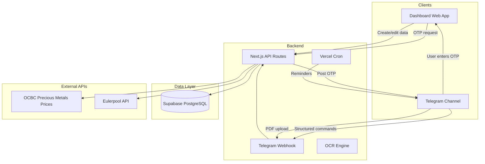

# Finance Tracking Dashboard — Implementation Plan v2

## Architecture Overview



---

## Summary of Key Design Decisions

| Area | Decision |
| --- | --- |
| **Onboarding** | Multi-user support — ask number of users first; guided Telegram setup with chat ID instructions; optional OCBC goals + current balance |
| **CPF** | Auto-calculated from income using allocation rates by age; **separated from bank accounts** — never counted in liquid net worth; dedicated CPF view with HDB/loans/retirement benchmarking |
| **Bank balance** | Derived from monthly inflow/outflow; inflow = take-home pay (gross salary − employee CPF contribution) |
| **Bank interest** | OCBC 360-style tiered logic based on inflow, balance delta, spend flag |
| **Savings goals** | OCBC-style (categories, monthly auto, release anytime); **create only on dashboard** |
| **Stocks** | Eulerpool API for real-time prices; image upload via Telegram command |
| **Gold & Silver** | OCBC precious metals pricing (scrape/cache OCBC indicative rates in SGD) |
| **PDF → OCR** | Send PDF bank statement to Telegram → OCR extracts transactions → auto-populate inflow/outflow |
| **Tax** | Fully automatic calculation — income from config, reliefs auto-derived where possible, progressive brackets applied; **no manual tax dashboard entry needed** |
| **Outflow deduplication** | ILP premiums, tax payments, loan repayments, stock purchases, insurance premiums tracked separately — system auto-deducts from outflow without double-counting |
| **Telegram** | Bidirectional: input from Telegram + dashboard, sync to same DB; user identified by **name** (set during onboarding) |
| **Reminders** | Configurable schedule (Settings); end of month, income yearly/monthly, insurance yearly/monthly, tax yearly |
| **Loans** | `/repay` = one-time amount input; `/earlyrepay` kept for early repayments |
| **Insurance** | Coverage gap analysis per user and combined; yearly outflow date per policy |
| **Layout** | Two top-level nav items: **Dashboard** (all metrics grouped in sections, investment overview) and **Settings** (general, user financial settings, notifications/Telegram, setup) |

---

## 1. Authentication (Telegram OTP Flow)

**Flow:**

1. User visits dashboard → clicks "Request OTP"
2. Platform generates 6-digit OTP (expires in 5 min), stores hash in Supabase
3. Platform sends OTP to the configured private Telegram channel via bot
4. User sees OTP in channel, enters it on dashboard
5. Platform validates OTP → issues session (cookie/JWT)

**Requirements:** One Telegram bot, one private channel/group. Bot must be admin to post OTPs. All household users share the channel to receive OTPs.

**Security:** Rate-limit OTP requests (e.g. 3 per 15 min per IP). Consider optional 2nd factor (e.g. PIN) for sensitive actions.

---

## 1a. UX-Driven Onboarding Flow

**Purpose:** Guide users through critical setup before they reach the dashboard. Ensures essential inputs are in place so the dashboard shows meaningful data.

**Flow:** After OTP auth, check `onboarding_completed`. If false → redirect to `/onboarding`. Complete all required steps → set flag → redirect to dashboard.

### Onboarding Steps (Progressive, UX-Driven)

| Step | Title | Critical Inputs | UX Notes |
| --- | --- | --- | --- |
| **1** | Welcome | — | Brief intro: "Track finances together. A few steps to get started." Progress: 1/8 |
| **2** | How many users? | `user_count` (1–6) | "How many people will be tracking?" Dynamically generates profile forms for the selected count. |
| **3** | Profiles | Per user: `name`, `birth_year` | "Who's tracking?" Name is used as the **Telegram command identifier** (e.g. `/in john 15000`). Birth year for CPF age band. Tooltip on birth year. |
| **4** | Income | Per profile: `annual_salary`, `bonus_estimate`, `pay_frequency` | "Income drives CPF projection and take-home pay." Tooltip: CPF allocation by age, net pay = gross − employee CPF. Can skip → Settings. |
| **5** | Bank accounts | At least 1: `bank_name`, `account_type` (ocbc_360 / basic), `profile_id` or combined | "Add your first bank." If **OCBC** selected → sub-step: optional savings goals + current balance (see below). Tooltip on account type. |
| **5a** | OCBC Goals *(conditional, optional)* | Goal name, target amount, current amount | Only shown when an OCBC account is added. "Set savings goals for this account?" Skip → add later in Dashboard. |
| **6** | Telegram setup | Channel/group chat ID, bot token verification | Step-by-step Telegram instructions (see below). Verify bot can post to channel. |
| **7** | Reminders & schedule | Prompt schedule: end-of-month, income, insurance, tax; timezone | "When should we remind you?" |
| **8** | You're all set | — | Summary of what was configured. CTA: "Go to Dashboard" |

### Telegram Setup Instructions (Step 6 Detail)

The onboarding step includes a guided walkthrough for finding the Telegram channel/chat ID:

**Option A — Use @chatIDrobot (easiest):**
1. Create a Telegram group or channel for your household.
2. Add the bot `@chatIDrobot` to the group.
3. Send any message — the bot replies with the chat ID (e.g. `-1001234567890`).
4. Copy that ID and paste it into the field below.
5. Remove `@chatIDrobot` from the group.

**Option B — Extract from Telegram Web:**
1. Open [web.telegram.org/a](https://web.telegram.org/a) and log in.
2. Open your group — the URL shows the ID in the hash (e.g. `#-1527776602`).
3. Replace `#-` with `-100` → `-1001527776602`.
4. Paste the resulting ID.

**Option C — Use message link:**
1. Right-click any message in the group → "Copy Message Link".
2. The link looks like `https://t.me/c/123456789/42`.
3. Take the number after `/c/` (e.g. `123456789`) and prepend `-100` → `-100123456789`.

**Verification:** After entering the chat ID, the platform sends a test message "✅ Connected to fdb-tracker" to the channel. If it appears, setup is complete.

### OCBC Goals Sub-Step (Step 5a Detail)

When any bank account is OCBC, an optional sub-step appears:

- "Would you like to set savings goals for this OCBC account?"
- If yes: add goal name, target amount, current amount (pre-filled to 0)
- Multiple goals can be added
- If no: skip — goals can be added later from the Dashboard

### UX Principles

- **Progress indicator:** Step X of Y; visual progress bar
- **Navigation:** Back / Next; "Save & continue" on each step
- **Skip where appropriate:** Income, goals, some prompts — "I'll add this later" → Settings
- **Tooltips:** Every input has a tooltip explaining logic and why it matters
- **Validation:** Inline validation; clear error messages
- **Persistence:** Save each step to DB; resume if user leaves mid-flow
- **Mobile-friendly:** Single-column, large touch targets

### Optional (Defer to Settings)

- Insurance policies
- OCBC 360 Insure/Invest toggles (if not OCBC 360, skip)
- ILP products, loans

### Data Model

- `households` — top-level entity; `user_count`, `onboarding_completed_at`
- `profiles` — per user within household; `name` used as Telegram command identifier
- Store step data as it's entered; no need to re-enter if user returns

---

## 2. Data Model (Supabase Schema)

### Core Tables

| Table | Purpose |
| --- | --- |
| `households` | Top-level entity (id, user_count, telegram_chat_id, telegram_bot_token, onboarding_completed_at, created_at) |
| `profiles` | Users within a household (id, household_id, name — **used as Telegram command identifier**, telegram_user_id, birth_year for CPF age band, created_at) |
| `bank_accounts` | Per-person or shared banks (profile_id or null for combined), bank_name, account_type (e.g. ocbc_360, basic) |
| `monthly_cashflow` | Inflow/outflow per month per profile — **drives bank balance**. Inflow = take-home pay (after CPF deduction). |
| `bank_balance_snapshots` | Opening balance per account per month (derived or manual override) |
| `savings_goals` | Goal name, target_amount, current_amount, monthly_auto_amount, deadline, category, profile_id or null (combined) — **created only on dashboard** |
| `goal_contributions` | Contributions linked to goals (manual top-up or auto monthly) |
| `investments` | Holdings (type: stock/gold/silver/ilp, symbol/fund, units, cost_basis, profile_id or null for **combined**) |
| `investment_transactions` | Buy/sell journal (symbol, quantity, price, date, **journal_text**, **screenshot_url** for stock image uploads) |
| `ilp_products` | Per ILP: name, **monthly_premium** (fixed), **end_date**, profile_id or null |
| `ilp_entries` | Monthly: **fund_value only** (premium from product; tracks performance) |
| `cpf_balances` | Per profile: OA, SA, MA — **auto-calculated from income** or manual override. **Separate from bank accounts — never counted in liquid net worth.** |
| `cpf_housing_usage` | CPF used for housing (loan_id, principal_withdrawn, accrued_interest, withdrawal_date) |
| `income_config` | Per profile: annual_salary, bonus_estimate, pay_frequency, **employee_cpf_rate** (auto from age); yearly/monthly prompt to update |
| `tax_entries` | Yearly tax — **auto-calculated** (year, calculated_amount, actual_amount for comparison) |
| `tax_relief_inputs` | Per profile per year: inputs for reliefs that require manual entry (donations, parent, spouse, WMCR, course fees, life insurance) |
| `tax_relief_auto` | Per profile per year: auto-derived reliefs (earned income, CPF, SRS — system calculates from existing data) |
| `loans` | Loan (profile_id, name, type: housing/personal, principal, rate_pct, tenure_months, start_date, lender, **use_cpf_oa**) |
| `loan_repayments` | One-time repayment entries (loan_id, amount, principal_portion, interest_portion, date) — `/repay` is a single amount input |
| `loan_early_repayments` | Early repayments (loan_id, amount, date) — reduces principal, offsets future interest |
| `insurance_policies` | Per policy: profile_id, name, type (term/whole life/shield/critical illness/endowment/ILP), premium_amount, frequency (monthly/yearly), **yearly_outflow_date** (month when premium is due), coverage_amount, is_active, deduct_from_outflow |
| `insurance_coverage_benchmarks` | Per profile: death_coverage_target, ci_coverage_target, hospitalization_coverage — for gap analysis |
| `insurance_premium_schedule` | Optional: age_band → premium (for policies with age-based pricing) |
| `prompt_schedule` | Settings: when to send each Telegram prompt (day of month, time, timezone, **frequency: monthly/yearly**) |
| `bank_account_ocbc360_config` | Per OCBC 360 account: salary_met, save_met, spend_met, **insure_met** (toggle), **invest_met** (toggle), grow_met |
| `ocr_uploads` | PDF uploads and OCR results: file_url, parsed_data (JSON), status, profile_id, month |
| `telegram_commands` | Audit log of parsed commands |
| `precious_metals_prices` | Cached OCBC gold/silver prices (metal_type, buy_price_sgd, sell_price_sgd, unit, last_updated) |

### Key Relationships

- **Household → Profiles:** One household, many users (dynamic count set during onboarding)
- **Combined comparison:** Every metric supports `profile_id` (individual) or `null` (combined). Dashboard shows individual vs combined toggle.
- **CPF is separate:** CPF balances are never added to bank account totals. Net worth shows them as a distinct category.
- **Outflow deduplication:** Insurance, ILP, tax, loan repayments, stock purchases each tracked in their own tables. The `monthly_cashflow.outflow` field represents **discretionary outflow only**. Total effective outflow = discretionary + sum of all tracked deductions.

---

## 3. Calculation Logic (Minimal Inputs → Max Derived)

### Inputs You Provide (Minimized via Backend Logic)

| Input | Frequency | Where |
| --- | --- | --- |
| **Income** | 1-time setup + yearly/monthly prompt | Dashboard (Settings) |
| Monthly inflow | Monthly (or via PDF OCR) | Telegram / Dashboard |
| Monthly outflow | Monthly (or via PDF OCR) | Telegram / Dashboard |
| Stock buy/sell + journal | Per trade | Telegram / Dashboard |
| Stock screenshot upload | Per trade (optional) | Telegram (command + image) |
| **ILP fund value** | Monthly (end of month) | Telegram / Dashboard — premium from product |
| Savings goal contributions | On update | Telegram (`/goaladd`) / Dashboard |
| Bank account type + OCBC 360 flags | Once | Dashboard (Insure/Invest toggles if OCBC 360) |
| **Insurance policies** | Yearly (prompt) | Dashboard (Settings) — premium, coverage, yearly outflow date |
| **Prompt schedule** | Once | Dashboard (Settings) |
| Tax relief manual inputs | Yearly (only non-auto reliefs) | Dashboard |
| **PDF bank statement** | Monthly (optional) | Telegram (send PDF) |

**Income:** 1-time: annual salary, bonus estimate, pay frequency. Configurable as yearly or monthly prompt to update. CPF and take-home pay derived from this.

**ILP:** Create product on dashboard with monthly premium + end date. Premium is fixed until end date. Monthly input: fund value only.

**Savings goals:** Target, monthly auto-amount, category — **created only on dashboard**. Contributions via Telegram or dashboard.

### 3.1 Inflow Logic — Annual Salary with CPF Deduction

**Key principle:** Inflow to bank account = take-home pay, NOT gross salary. CPF employee contribution is deducted before money hits the bank.

**Formula:**
```
monthly_gross = annual_salary / 12
employee_cpf = min(monthly_gross, OW_ceiling) × employee_cpf_rate
monthly_take_home = monthly_gross - employee_cpf
```

**CPF Contribution Rates (2025) by Age:**

| Age Group | Employee Rate | Employer Rate | Total | OW Ceiling |
| --- | --- | --- | --- | --- |
| ≤ 55 | 20% | 17% | 37% | $7,400/mth |
| 56–60 | 15% | 15.5% | 30.5% | $7,400/mth |
| 61–65 | 9% | 11% | 20% | $7,400/mth |
| 66–70 | 7.5% | 9% | 16.5% | $7,400/mth |
| > 70 | 5% | 7.5% | 12.5% | $7,400/mth |

**CPF Contribution Rates (2026, effective 1 Jan 2026) by Age:**

| Age Group | Employee Rate | Employer Rate | Total | OW Ceiling |
| --- | --- | --- | --- | --- |
| ≤ 55 | 20% | 17% | 37% | $8,000/mth |
| 56–60 | 18% (+1%) | 16% (+0.5%) | 34% (+1.5%) | $8,000/mth |
| 61–65 | 12.5% (+1%) | 12.5% (+0.5%) | 25% (+1.5%) | $8,000/mth |
| 66–70 | 7.5% | 9% | 16.5% | $8,000/mth |
| > 70 | 5% | 7.5% | 12.5% | $8,000/mth |

**Key 2026 changes:** OW ceiling raised from $7,400 → $8,000. Ages 55–65 see +1.5% total rate increase (allocated to RA). AW ceiling: $102,000 − YTD OW.

**Example (age ≤ 55, $7,000/mth gross):**
- Employee CPF: $7,000 × 20% = $1,400
- Take-home (inflow): $7,000 − $1,400 = **$5,600**
- Employer CPF: $7,000 × 17% = $1,190 (goes to CPF accounts, not bank)

**Bonus handling:** Bonus is Additional Wage (AW). AW ceiling = $102,000 − (12 × monthly OW subject to CPF). CPF deducted from bonus too.

**Implementation:**
1. `income_config` stores gross salary, bonus, pay frequency, profile birth_year
2. System auto-computes age → lookup CPF rate → derive take-home
3. When user reports `/in`, system can validate against expected take-home or accept override
4. Monthly `cpf_balances` auto-updated from employer + employee contributions allocated to OA/SA/MA

### 3.2 PDF → OCR → Inflow/Outflow

**Flow:**
1. User sends PDF bank statement to Telegram channel (no command needed — bot detects PDF)
2. Telegram webhook stores the PDF URL in the database
3. Bot replies: "📄 PDF bank statement received and stored. Please enter the cash flow data manually on the dashboard."
4. User enters inflow/outflow data manually via dashboard

**Note:** OCR functionality has been removed as it requires paid services. Manual data entry is now required.

**Data stored:** `ocr_uploads` table stores the file URL, raw parsed JSON, confirmation status, and linked month/profile.

### 3.3 Stock Image Upload via Telegram

**Trigger:** Stock screenshots (e.g. brokerage confirmation) require a command prefix to distinguish from general images.

**Command:** `/stockimg [SYMBOL] [optional journal text]` followed by an image in the same message or next message.

**Flow:**
1. User sends `/stockimg DBS Added to position` with an attached image
2. Bot stores the image in Supabase Storage
3. Links the image URL to `investment_transactions.screenshot_url`
4. Bot confirms: "📸 Screenshot saved for DBS"

**No OCR on stock images** — images are stored as reference attachments, not parsed. The buy/sell data itself comes from `/buy` and `/sell` commands.

### 3.4 Tax Calculation — Fully Automatic

**Key change from v1:** Tax amount is **calculated automatically** from income and reliefs. No manual tax amount entry needed on the dashboard. The actual IRAS assessment can optionally be entered for comparison.

#### Auto-Derived Reliefs (No User Input Needed)

These reliefs are calculated automatically from data already in the system:

| Relief | Source | Amount | Where Money Flows |
| --- | --- | --- | --- |
| **Earned Income** | `profiles.birth_year` → age | $1,000 (≤54), $6,000 (55–59), $8,000 (60+) | N/A (auto) |
| **CPF (employee)** | `income_config` → auto CPF calc | Up to OW ceiling × employee rate × 12 (up to $37,740) | CPF accounts |
| **CPF Cash Top-Up (own)** | Tracked in `cpf_balances` if user tops up SA/RA | Up to $8,000 | CPF SA or RA |
| **CPF Cash Top-Up (family)** | Tracked if user tops up family member's SA/RA | Up to $8,000 | Family member's CPF |
| **SRS Contribution** | Track SRS contributions in `investment_transactions` or dedicated field | Up to $15,300 (citizen/PR) | SRS account (investable) |
| **Life Insurance** | `insurance_policies` where type = life/whole life/endowment | Lower of ($5,000 − CPF relief) or 7% insured sum | Insurance policy |
| **NSman (Self, Wife, Parent)** | `profiles` metadata — NS status, key/non-key appointment | Self: $1,500–$5,000; Wife: $750; Parent: $750–$3,500 | N/A |

#### Manual-Input Reliefs (User Enters Yearly)

These require information the system cannot derive:

| Relief | Input | Limit | Where Money Flows |
| --- | --- | --- | --- |
| **Donations (IPC)** | Donation amount | 250% deduction | Approved IPC charity |
| **Parent Relief** | Supporting parent(s), co-residing | $5,500–$9,000 per parent, max 2 | N/A |
| **Spouse Relief** | Spouse income < $4k | $2,000 | N/A |
| **WMCR** | Working mother, SC children count + birth years | $8k/$10k/$12k per child (post-2024) or % of income (pre-2024) | N/A |
| **Course Fees** | Qualifying course fees paid | Up to $5,500 | Education |
| **Foreign Domestic Worker Levy** | Levy paid | $5,200 (married women with dependents) | N/A |
| **Handicapped Sibling** | Sibling details | $5,500 | N/A |

#### Tax Calculation Engine

```
Step 1: employment_income = annual_salary + bonus (from income_config)
Step 2: auto_reliefs = earned_income + cpf + srs + life_insurance + nsman + cpf_topup
Step 3: manual_reliefs = donations_250% + parent + spouse + wmcr + course_fees + ...
Step 4: total_reliefs = min(auto_reliefs + manual_reliefs, $80,000)  // overall cap
Step 5: chargeable_income = max(employment_income - total_reliefs, 0)
Step 6: tax_payable = apply_progressive_brackets(chargeable_income)
Step 7: tax_payable = tax_payable - rebate (if applicable, e.g. YA2025: 60% capped $200)
```

**Progressive Brackets (YA 2024 onwards):**

| Chargeable Income | Rate |
| --- | --- |
| First $20,000 | 0% |
| $20,001–$30,000 | 2% |
| $30,001–$40,000 | 3.5% |
| $40,001–$80,000 | 7% |
| $80,001–$120,000 | 11.5% |
| $120,001–$160,000 | 15% |
| $160,001–$200,000 | 18% |
| $200,001–$240,000 | 19% |
| $240,001–$280,000 | 19.5% |
| $280,001–$320,000 | 20% |
| $320,001–$500,000 | 22% |
| $500,001–$1,000,000 | 23% |
| Above $1,000,000 | 24% |

**Dashboard Inputs for Tax (per profile, per year):**

- Employment income (from income_config or override)
- SRS contribution (auto-tracked or manual)
- CPF cash top-up (own, family — auto-tracked or manual)
- Donations to IPC
- Life insurance premium (auto from insurance_policies if CPF < $5k)
- Parent/spouse/WMCR/course fees (checkboxes + amounts)
- NSman status (auto from profile metadata)
- Actual tax paid (from IRAS) — **optional**, for comparison with calculated

**Dashboard output:** Shows calculated tax per user, relief breakdown (which reliefs applied, how much each saved), and where relief money flowed (SRS account, CPF, charities). "Tax saved" from each relief. Optional: enter actual IRAS assessment for comparison.

**Money flow tracking:** Track where relief money went (SRS, CPF, donations, etc.) for net worth and cashflow integration.

### 3.5 Outflow Deduplication Logic

**Problem:** ILP premiums, tax payments, loan repayments, stock purchases, and insurance premiums all reduce the bank balance. If these are tracked in their own tables AND the user reports total outflow via `/out`, they get double-counted.

**Solution — Separation of Concerns:**

```
effective_outflow = discretionary_outflow        // user-reported via /out (food, transport, etc.)
                  + insurance_premiums_monthly    // from insurance_policies (auto-deducted)
                  + ilp_premiums_monthly          // from ilp_products (auto-deducted)
                  + loan_repayments_monthly       // from loan_repayments (auto-deducted)
                  + tax_monthly_provision         // tax_payable / 12 (auto-deducted, optional)
```

**Rules:**
1. **`/out` captures discretionary spending only.** The bot instructs: "Report your spending outflow (exclude insurance, ILP, loan, tax — those are tracked automatically)."
2. **Auto-deducted items** are summed separately from their respective tables.
3. **Stock purchases** reduce the bank balance but are an **asset exchange** (cash → equity), not an expense. Tracked in `investment_transactions`; bank balance adjusted, but not counted as "outflow" for savings rate.
4. **Deduplication guard:** If the user's `/out` is suspiciously high (e.g. includes known auto-deducted amounts), the bot warns: "Your outflow seems high. Did you include insurance/loan payments? Those are tracked automatically."
5. **Bank balance formula:** `closing_balance = opening + inflow - effective_outflow - stock_purchases_net + stock_sales_net`
6. **Savings rate formula:** `(inflow - effective_outflow) / inflow × 100` — stock trades excluded (asset exchange).

**Visualization:** Dashboard Cashflow section shows a waterfall or stacked bar: Discretionary | Insurance | ILP | Loans | Tax — so users see where money goes.

### 3.6 Bank Balance (Derived from Cashflow)

**Logic:** `end_of_month_balance = opening_balance + inflow - effective_outflow - net_stock_purchases`

- Opening balance: previous month's closing balance (or manual seed for first month)
- **Effective outflow** = discretionary `/out` + auto-deducted insurance + ILP + loan repayments
- When user inputs `/in` and `/out` for a month, system recalculates closing balance
- No manual balance entry needed unless correcting/adjusting

### 3.7 Insurance — Coverage Analysis, Gap Detection, Yearly Outflow Date

#### Per-Policy Data

| Field | Description |
| --- | --- |
| `name` | Policy name (e.g. "AIA Term Life Plan") |
| `type` | term_life, whole_life, integrated_shield, critical_illness, endowment, ilp, personal_accident |
| `premium_amount` | Current premium |
| `frequency` | monthly or yearly |
| `yearly_outflow_date` | The **month** the yearly premium is due (1–12). For monthly, set to null. |
| `coverage_amount` | Sum assured / coverage limit |
| `coverage_type` | death, critical_illness, hospitalization, disability, personal_accident |
| `is_active` | Active or lapsed |
| `deduct_from_outflow` | Auto-deduct from effective outflow |
| `profile_id` | Per user; null = combined/shared |

#### Age-Based Premium Logic

Many Singapore policies use age bands. Examples:

- **Term life:** ~$200–300 (21–30) → $500+ (31–40) → $900+ (41–50) → $1,100+ (51–60) → $1,300+ (61–70) → $2,800+ (71+)
- **Integrated Shield:** ~$95 (21–30) → $135 (31–40) → $185 (41–50) → $285 (51–60) → $450 (61+)

**Implementation:** Store `insurance_premium_schedule` (age_band_min, age_band_max, premium) per policy type, or user enters current premium yearly. When `profiles.birth_year` changes age band, prompt to update. Use `insurance_premium_schedule` to project future premiums if available.

#### Yearly Outflow Date Logic

- Yearly premiums are due in a specific month. The system:
  1. In the due month: adds the full yearly premium to that month's effective outflow
  2. For projections/budgeting: spreads as monthly equivalent (yearly / 12)
  3. Telegram reminder sent 1 week before the due month: "🔔 [Policy] premium of $X due in [Month]."

#### Coverage Gap Analysis

**Framework:** Based on LIA Singapore benchmarks and industry standards.

**Recommended Coverage Benchmarks:**

| Coverage Type | Benchmark | Formula |
| --- | --- | --- |
| **Death / Total Permanent Disability** | 9–10× annual income | `annual_salary × 10` |
| **Critical Illness** | 4× annual income | `annual_salary × 4` |
| **Hospitalization** | Full coverage (Integrated Shield Plan) | Check for active ISP |
| **Disability Income** | 75% of monthly salary | `monthly_salary × 0.75` |

**Per-User Gap Calculation:**
```
death_coverage_held = sum(coverage_amount) where coverage_type = 'death' and is_active
death_coverage_needed = annual_salary × 10
death_gap = max(death_coverage_needed - death_coverage_held, 0)
death_gap_pct = death_gap / death_coverage_needed × 100

// Same for critical_illness, hospitalization, disability
```

**Combined Household View:**
- Sum all users' coverage held vs needed
- Show household total gap

**Charts (Best Visualization):**

| Chart Type | What It Shows |
| --- | --- |
| **Radar/Spider chart** | Per user: coverage % across all types (death, CI, hospitalization, disability) — quickly shows shape of protection |
| **Stacked horizontal bar** | Per coverage type: covered (green) vs gap (red) — per user side-by-side |
| **Coverage heatmap** | Rows = users, columns = coverage types, color = % covered (red/yellow/green) |
| **Donut chart** | Total household: covered vs gap, with breakdown by type |

**"What Our Plan Covers vs Lacks" View:**
- Table per user listing each policy, what it covers, what it doesn't
- Highlight: "No critical illness coverage" or "Hospitalization only covers B1 ward"
- Actionable recommendation: "Consider adding term life to close $X death coverage gap"

### 3.8 Bank Interest (OCBC 360-Style Logic)

**Reference:** OCBC 360 Account (May 2025 rates). Interest is tiered by balance and category fulfillment.

| Category | First S$75,000 | Next S$25,000 | Requirement |
| --- | --- | --- | --- |
| Base | 0.05% | 0.05% | Always |
| Salary | 1.60% | 3.20% | Inflow ≥ S$1,800 (salary credit) |
| Save | 0.60% | 1.20% | Avg daily balance increase ≥ S$500 vs prev month |
| Spend | 0.50% | 0.50% | Credit card ≥ S$500 (manual flag or link) |
| Insure | 1.20% | 2.40% | Insurance with OCBC |
| Invest | 1.20% | 2.40% | Invest via OCBC |
| Grow | 2.20% | 2.20% | Balance > S$250,000 |

**Implementation:** Per `bank_accounts` row, store `account_type` (e.g. `ocbc_360`, `basic`). For OCBC 360, use `bank_account_ocbc360_config` to store which categories are met.

**Configurable Insure & Invest (Settings):** User may not have Insure or Invest yet. In Settings → Bank Accounts → OCBC 360:

- **Insure:** Toggle "I have qualifying OCBC insurance" (endowment ≥$4k, whole life ≥$8k, protection ≥$2k, etc.). If off, no Insure bonus.
- **Invest:** Toggle "I have qualifying OCBC investments" (unit trusts ≥$20k, structured deposits ≥$20k, etc.). If off, no Invest bonus.
- **Salary, Save, Spend:** derived from data where possible; manual override if needed.
- **Grow:** auto from balance > $250k.

Compute tiered interest: apply each bonus (only for categories where met) to the relevant balance band, sum, annualize to monthly.

For non-360 accounts: use simple `interest_rate_pct` if provided.

### 3.9 Derived Calculations

| Metric | Formula |
| --- | --- |
| **Liquid net worth** | Sum of bank balances + non-CPF investments (stocks, gold, silver, ILP fund value) − outstanding loan balances. **CPF excluded.** |
| **Total net worth** | Liquid net worth + CPF (OA + SA + MA) + property equity estimate |
| **Estimated monthly interest** | OCBC 360 tiered logic or simple rate |
| **Savings rate** | (Inflow − Effective outflow) / Inflow × 100 (stock trades excluded) |
| **Goal progress** | current_amount / target_amount × 100 |
| **Stock P&L** | (eulerpool_price × units) − cost_basis |
| **Gold/Silver value** | units × OCBC indicative price (SGD) |
| **CPF total** | OA + SA + MA per profile (separate from liquid net worth) |
| **Tax payable** | Auto-calculated from income − reliefs → brackets |

---

## 3a. CPF — Dedicated View with HDB, Loans & Retirement Benchmarking

### Why CPF Is Separate from Bank Accounts

CPF funds are **not liquid** — they cannot be freely withdrawn or spent. Key differences:
- **Withdrawal restrictions:** Most funds locked until age 55 (and even then, subject to BRS/FRS)
- **Housing usage:** CPF used for housing must be refunded with 2.5% accrued interest on sale
- **MediSave:** Cannot be withdrawn; only for approved medical expenses
- **SA/RA:** Locked for retirement; earns higher interest (4% base + 1% extra on first $60k)

**In this system:** CPF appears in its own dedicated section within the Dashboard. It contributes to **Total Net Worth** but is clearly labeled as "locked/retirement" and excluded from **Liquid Net Worth**.

### CPF Balances (Auto-Calculated from Income)

**Logic:** Input monthly income (ordinary + additional wage) → apply contribution rates by age → apply allocation to OA/SA/MA.

**Implementation:** `profiles.birth_year` → compute age → lookup allocation. `income_config` stores annual salary + bonus; derive monthly OW + AW (or use pay frequency). Apply ceiling, compute contribution, split to OA/SA/MA. Accumulate into `cpf_balances` or overwrite if manual override exists.

**CPF Allocation by Age (2025):**

| Age | OA | SA | MA |
| --- | --- | --- | --- |
| ≤ 35 | 34.00% | 8.86% | 57.14% |
| 36–45 | 30.00% | 10.00% | 60.00% |
| 46–50 | 26.39% | 11.11% | 62.50% |
| 51–55 | 20.59% | 15.78% | 63.63% |
| 55+ | RA instead of SA; different splits | | |

**CPF Allocation by Age (2026, effective 1 Jan 2026):**

| Age | OA | SA/RA | MA |
| --- | --- | --- | --- |
| ≤ 35 | 47.59% | 12.41% | 40.00% |
| 36–45 | 42.87% | 14.28% | 42.85% |
| 46–50 | 38.39% | 16.16% | 45.45% |
| 51–55 | 30.20% | 23.14% | 46.66% |
| 56–60 | 27.25% | 26.09% (RA) | 46.66% |
| 61–65 | 11.15% | 35.01% (RA) | 53.84% |

**Monthly CPF flow:**
```
total_cpf_contribution = min(monthly_gross, $8,000) × total_rate
oa_contribution = total_cpf_contribution × oa_allocation_pct
sa_contribution = total_cpf_contribution × sa_allocation_pct
ma_contribution = total_cpf_contribution × ma_allocation_pct
```

### CPF Sub-Views (Within Dashboard CPF Section)

#### Sub-View 1: CPF Overview
- **Per user:** OA, SA, MA balances (projected from income contributions)
- **Combined:** Total CPF across all users
- **Monthly contribution breakdown:** Bar chart showing OA/SA/MA allocation per month
- **Growth projection:** Line chart projecting CPF growth at current income (with 2.5% OA / 4% SA,MA interest)

#### Sub-View 2: CPF for HDB / Housing

**Reference:** [CPF — Using your CPF to buy a home](https://www.cpf.gov.sg/member/home-ownership/using-your-cpf-to-buy-a-home)

**What CPF OA Can Be Used For:**
- HDB flat or private residential property purchase
- Down payment, stamp duty, legal fees
- Monthly housing loan repayments
- Home Protection Scheme premiums (HDB only)
- Loan for construction (private); purchase of vacant land (private)

**CPF Accrued Interest (Must Refund on Sale):**

When you use CPF OA for housing, you must refund **principal withdrawn + accrued interest** when you sell the property. Accrued interest is computed at **2.5% p.a. compounded monthly** on all OA used.

**Formula:** `Accrued interest = Principal × [(1 + 0.025/12)^months − 1]` (from withdrawal date to sale/voluntary refund).

**Example:** $200,000 principal over 10 years ≈ $91,386 accrued interest (total refund ~$291,386).

**CPF Housing Withdrawal Limits:**

| Rule | Detail |
| --- | --- |
| **120% Valuation Limit** | OA usage capped at 120% of Valuation Limit (VL = lower of purchase price or market valuation). Covers down payment, stamp duty, legal fees, and monthly mortgage. Beyond 120% VL → cash only. |
| **Age 55+** | Must set aside Basic Retirement Sum (BRS, e.g. $106,500 for 2025, $110,200 for 2026) before further CPF use. Property with lease to age 95+ can be pledged. |

**Calculation Logic When `loans.use_cpf_oa = true`:**

1. **Track CPF withdrawn:** Per loan, store `cpf_housing_usage` — principal_withdrawn (down payment + monthly OA used), withdrawal dates.
2. **Accrued interest:** For each withdrawal, compute months from withdrawal to "as of" date (or sale). Sum: `principal + accrued_interest` = total CPF refund due.
3. **Refund at sale:** When property sold, total refund = sum of (principal + accrued) for that property. This restores retirement savings.
4. **Voluntary refund:** User can make voluntary refund before sale — reduces future accrued interest, improves cash proceeds at sale.

**Dashboard Metrics:**

| Metric | Source |
| --- | --- |
| CPF OA used for housing | Sum of `cpf_housing_usage.principal_withdrawn` |
| Accrued interest to date | `principal × [(1 + 0.025/12)^months − 1]` per withdrawal |
| Total refund due (on sale) | Principal + accrued interest |
| 120% VL remaining | `1.2 × valuation_limit − total_cpf_used` |
| OA balance after housing | OA total − OA used for housing |

**Charts:**
- Waterfall: OA total → used for housing → accrued interest → refund due → remaining OA
- Timeline: Monthly CPF usage for mortgage vs cash usage
- Option to model voluntary refund impact (reduce accrued interest, improve cash proceeds at sale)

#### Sub-View 3: Loan Integration
- Show loans that use CPF OA alongside their regular loan metrics
- Compare: "If you paid cash instead of CPF, you'd save $X in accrued interest but lose $Y in OA interest earnings"
- Amortization schedule showing CPF vs cash portions

#### Sub-View 4: Retirement Benchmarking
**CPF Retirement Sums (2026 cohort turning 55):**

| Benchmark | Amount | CPF LIFE Payout (est.) |
| --- | --- | --- |
| Basic Retirement Sum (BRS) | $110,200 | $890–$930/mth |
| Full Retirement Sum (FRS) | $220,400 | $1,640–$1,750/mth |
| Enhanced Retirement Sum (ERS) | $440,800 | $3,180–$3,410/mth |

**Per User:**
- Current CPF total vs BRS/FRS/ERS targets
- Progress bar: "You're at X% of FRS"
- Projected age when each benchmark is reached (at current contribution rate + interest)
- Gap: "You need $X more to reach FRS by age 55"

**Charts:**
- Gauge chart: Current CPF vs BRS/FRS/ERS
- Line projection: CPF growth over time with BRS/FRS/ERS horizontal lines
- Combined view: Side-by-side per user

**Assumptions for projection:**
- Income grows at configurable rate (default 3% p.a.)
- CPF interest: OA 2.5%, SA 4%, MA 4% (with extra 1% on first $60k combined, extra 2% for 55+)
- Retirement sums increase ~3.5% p.a.

---

## 3b. Loan Tracking & Early Repayment Calculator

### Loan Data Model

- **loans:** principal, annual_rate_pct, tenure_months, start_date, lender, type (housing/personal), `use_cpf_oa` (boolean)
- **loan_repayments:** `/repay` = **one-time amount input** per entry. Track each payment — amount, date. System derives principal_portion, interest_portion from amortization.
- **loan_early_repayments:** Lump sum or partial prepayments — amount, date. `/earlyrepay` command.

### What We Track

| Metric | Source |
| --- | --- |
| Total paid | Sum of `loan_repayments.amount` |
| Principal paid | Sum of `loan_repayments.principal_portion` |
| Interest paid | Sum of `loan_repayments.interest_portion` |
| Outstanding balance | Original principal − principal paid − early repayments |
| Early repayments | Sum of `loan_early_repayments.amount` |
| Interest offset by early repayment | Derived via amortization comparison |

### Amortization Logic

**Monthly payment:** `PMT = P × [r(1+r)^n / ((1+r)^n − 1)]`

**Per payment:** `interest_portion = outstanding_balance × (rate/12)`; `principal_portion = PMT − interest_portion`.

When early repayment is made: reduce outstanding balance; recalculate schedule (fewer remaining payments or lower PMT).

### Interest Saved Calculator

**Purpose:** Simulate early repayment scenarios.

**Inputs:** Loan details + hypothetical early repayment (amount, date).

**Logic:**
1. Build amortization for "no early repayment" scenario → total interest.
2. Apply early repayment at given date → reduce balance, shorten tenure.
3. Rebuild schedule → new total interest.
4. **Interest saved** = original − new total interest.

**Output:** Interest saved, new payoff date, remaining payments.

**UI:** Modal or dedicated page — enter loan, enter "what if" early repayment amount/date, see comparison.

---

## 3c. Gold & Silver — OCBC Precious Metals Pricing

### Pricing Source

Gold and silver values follow **OCBC's indicative buy/sell prices** since the user buys within the OCBC app (Precious Metals Account).

**OCBC Precious Metals Facts:**
- Minimum: 0.01 oz (0.31g)
- Trading: 24/7, real-time pricing
- Paper bullion — no physical storage
- Prices in SGD per oz

### Price Fetching Strategy

OCBC does not have a public API for precious metals prices. Strategy:

| Method | Description | Reliability |
| --- | --- | --- |
| **Primary: OCBC web scrape** | Scrape indicative buy/sell from [OCBC Precious Metals page](https://www.ocbc.com/personal-banking/investments/precious-metals-account.page) | Medium — page structure may change |
| **Fallback: GoldPricez / MetalpriceAPI** | Use commodity API for SGD gold/silver spot price | High — public API with free tier |
| **Manual override** | User enters current OCBC price in Settings | Always works |

**Caching:** Store in `precious_metals_prices` table. Refresh every 1–4 hours (during market hours). Display "Last updated: [time]" on dashboard.

**Valuation:**
```
gold_value_sgd = gold_units_oz × ocbc_gold_sell_price_sgd
silver_value_sgd = silver_units_oz × ocbc_silver_sell_price_sgd
```

Use **sell price** (what OCBC pays you) for portfolio valuation — conservative mark-to-market.

---

## 4. Telegram Integration

### Bidirectional Input (Telegram + Dashboard)

- **Single source of truth:** Supabase. Both Telegram and dashboard write to the same tables.
- **Sync:** Data entered in Telegram appears on dashboard; data entered on dashboard is reflected in Telegram views.
- **No conflict:** Use "set" semantics where applicable. Last write wins.

### User Identification — Name-Based

**Key change from v1:** Users are identified by **name** (set during onboarding), not `/me` or `/partner`.

**Format:** Every command includes the user's name as the first argument:

```
/in john 15000        → Set John's inflow to 15000
/out mary 8000        → Set Mary's outflow to 8000
/buy john DBS 100 35.50 Bought on dip   → John buys DBS
```

**Matching:** Case-insensitive match against `profiles.name`. If name not found, bot replies: "❌ Unknown user 'X'. Known users: John, Mary."

**Shortcut:** If only 1 user in household, name can be omitted: `/in 15000` → defaults to the sole profile.

### Structured Commands

| Command | Example | Action |
| --- | --- | --- |
| Inflow | `/in john 15000` | Set this month's inflow for John |
| Outflow | `/out john 8000` | Set this month's discretionary outflow |
| Stock buy | `/buy john DBS 100 35.50 Long term hold` | Buy + optional journal text |
| Stock sell | `/sell john DBS 50 36.00 Took profits` | Sell + optional journal text |
| Stock image | `/stockimg john DBS` + attached image | Save screenshot for DBS trade |
| ILP value | `/ilp john Prudential 45000` | End-of-month fund value |
| Goal add | `/goaladd john house 5000` | Add 5k to goal "house" |
| Repay | `/repay john Housing 2500` | **One-time repayment** for loan "Housing" |
| Early repay | `/earlyrepay john Housing 50000` | Early repayment for loan "Housing" |
| PDF upload | *(send PDF file)* | Auto-detect → OCR → parse inflow/outflow |
| Confirm OCR | `/confirm` | Confirm parsed PDF data |

**`/repay` is a one-time amount input:** Each `/repay` command logs a single repayment entry. No recurring logic — user sends `/repay` each time they make a payment.

**PDF upload:** No command needed. Bot detects when a PDF is sent and automatically triggers OCR parsing. Bot asks which user the statement belongs to if multiple users exist.

### Prompt Schedule (Settings Page)

**Configurable per prompt type with yearly or monthly frequency:**

| Prompt | Default | Frequency Options | Configurable |
| --- | --- | --- | --- |
| End of month | 1st, 9:00 AM | Monthly | Day (1–28), time, timezone |
| Income update | 1 Jan, 9:00 AM | **Yearly or Monthly** | Day, month (if yearly), time, timezone |
| Insurance update | 1 Jan, 9:00 AM | **Yearly or Monthly** | Day, month (if yearly), time, timezone |
| Tax | 1 Apr, 9:00 AM | Yearly | Day, month, time, timezone |

### Auto Reminders (Configurable)

- **End of month:** "Update [Month] finances: /in [name] $, /out [name] $, /ilp [name] [product] $, /goaladd. Or send PDF statement. Dashboard: [link]"
- **Income (yearly):** "Time to update income for [Year]: Dashboard → Settings → Income. Affects CPF projection and take-home pay."
- **Income (monthly):** "Confirm [Month] income: /in [name] $. Expected take-home: $X (based on gross $Y − CPF $Z)."
- **Insurance (yearly):** "Update insurance premiums for [Year] (age-based may have changed): Dashboard → Settings → Insurance."
- **Insurance (monthly):** "Insurance premium of $X for [Policy] due this month."
- **Tax (yearly):** "Year-end: review tax reliefs. Your calculated tax is $X. Dashboard: [link]"
- **Implementation:** Vercel Cron or Supabase Edge Function; schedule from `prompt_schedule`

---

## 5. Dashboard Layout & Views

### Layout: Two Top-Level Nav Items

**Side Nav:**

```
📊 Dashboard
   ├── Overview (net worth, savings rate, key metrics)
   ├── Banks (balances, interest, OCBC 360)
   ├── CPF (OA/SA/MA, housing, retirement)
   ├── Cashflow (inflow/outflow breakdown)
   ├── Investments Overview (summary, allocation)
   ├── Savings Goals (OCBC-style)
   ├── Loans (repayments, calculator)
   ├── Insurance (coverage, gaps)
   └── Tax (auto-calculated, reliefs)

⚙️ Settings
   ├── General (theme, timezone, data export)
   ├── User Settings (per-user financial config)
   │   ├── Income
   │   ├── Bank Accounts (OCBC 360 toggles)
   │   ├── Insurance Policies
   │   ├── ILP Products
   │   └── Loans
   ├── Notifications & Telegram
   │   ├── Telegram Setup (bot, channel)
   │   └── Prompt Schedule
   └── Setup
       ├── Profiles (add/edit users)
       └── Re-run Onboarding
```

**Key design principle:** Dashboard is the **single destination** for all financial metrics. Every metric belongs here, grouped into logical sections. The Investments page is a **detail page** accessible from the Investments Overview section in the Dashboard.

### Dashboard Sections

#### Section 1: Overview
- **Hero metrics:** Total Net Worth (with CPF labeled separately), Liquid Net Worth, Monthly Savings Rate
- **Mini cards:** Total bank balance, Total CPF, Total investments, Total loans outstanding
- **Chart:** Net worth trend (line, 12 months)
- **Toggle:** Combined | [User 1] | [User 2] | ...

#### Section 2: Banks
- Per-bank balance (derived from cashflow)
- OCBC 360 interest projection with category breakdown
- Month-over-month balance change

#### Section 3: CPF
- **OA/SA/MA per user** (auto from income)
- **Housing sub-view:** CPF used for HDB, accrued interest, refund due
- **Loans sub-view:** Loans using CPF OA
- **Retirement sub-view:** Progress toward BRS/FRS/ERS, projection chart

#### Section 4: Cashflow
- Monthly inflow vs effective outflow (stacked bar or waterfall)
- Breakdown: Discretionary | Insurance | ILP | Loans | Tax
- Trend: 12-month rolling

#### Section 5: Investments Overview
- **Summary:** Total value, total P&L, allocation by type (stocks, gold, silver, ILP)
- **Quick table:** Top holdings with current value and P&L
- **Link:** "View full investments →" → opens detailed Investments page

#### Investments Detail Page (Separate Route)
- **Full holdings table:** Symbol, units, cost basis, current value, P&L, % of portfolio
- **Market breakdown:** By market (SGX, US, etc.) or asset type — pie/bar chart
- **ILP section:** Per product — fund value, premium, performance over time
- **Gold & Silver:** Holdings valued at OCBC prices, buy/sell history
- **Journals:** Investment transactions with journal text + screenshots — filterable
- **Create journal:** Add buy/sell with optional journal text

#### Section 6: Savings Goals
- OCBC-style goal cards with progress bars
- Create, top up, withdraw, extend deadline
- Goal categories (preset + custom)

#### Section 7: Loans
- Loan list: principal, outstanding, rate, monthly payment
- Repayment history, early repayments
- Interest saved calculator
- CPF housing integration (link to CPF section)

#### Section 8: Insurance
- **Coverage per user:** Policies listed by type
- **Gap analysis:** Radar chart + horizontal bars showing coverage vs benchmark
- **Combined view:** Household total coverage vs needs
- **"Covers vs Lacks" table:** What each policy covers, identified gaps, recommendations
- **Upcoming premiums:** Calendar view of yearly outflow dates

#### Section 9: Tax
- **Auto-calculated tax per user** — no manual entry needed
- Relief breakdown: auto-derived vs manual, amount per relief, where money flowed
- Optional: IRAS actual assessment for comparison
- Chart: Tax breakdown by relief category

### Settings Detail

#### General Settings
- Theme (light/dark/system)
- Timezone
- Data export (CSV, JSON)
- Currency display preferences

#### User Settings (Per-User Financial Config)
- **Income:** Annual salary, bonus, pay frequency — configurable as yearly or monthly update
- **Bank Accounts:** Bank list, account types, OCBC 360 Insure/Invest toggles
- **Insurance Policies:** Add/edit policies with coverage amounts, premiums, yearly outflow date, age-band pricing
- **ILP Products:** Monthly premium, end date, fund name
- **Loans:** Principal, rate, tenure, CPF OA usage, lender

#### Notifications & Telegram
- **Telegram Setup:** Bot token, channel chat ID, test connection
- **Prompt Schedule:** Configure each reminder type — frequency (monthly/yearly), day, time, timezone

#### Setup
- **Profiles:** Add/edit/remove users in the household
- **Re-run Onboarding:** Reset and walk through onboarding again

### Tooltips (Logic, Explanation & Calculation Details)

**Purpose:** Show tooltips on metrics, config fields, and calculation results so users understand the logic, meaning, and assumptions without leaving the page.

**Implementation:** Use shadcn `Tooltip` (or `HoverCard` for longer content). Icon (e.g. `Info` or `HelpCircle`) next to label/value; hover or click to reveal. Content stored in a central registry (e.g. `lib/tooltips.ts`) for consistency and easy updates.

**Tooltip content structure (per area):**

- **Logic:** How it's calculated (formula, inputs)
- **Explanation:** What it means, why it matters
- **Details:** Assumptions, caveats, edge cases

**Areas requiring tooltips:**

| Area | Location | Tooltip content |
| --- | --- | --- |
| **Net worth** | Dashboard, Overview | Formula: Banks + Investments + ILP − Loans. CPF shown separately (locked/retirement). Explanation: Total assets minus liabilities. Details: Investments use live prices (Eulerpool); ILP uses last entered fund value. |
| **Liquid net worth** | Dashboard, Overview | Formula: Banks + Investments + ILP − Loans. **Excludes CPF** (locked/retirement funds not freely accessible). |
| **Savings rate** | Dashboard, Cashflow | Formula: (Inflow − Effective outflow) / Inflow × 100. Explanation: % of income saved. Details: Effective outflow includes auto-deducted insurance, ILP, loans. Stock trades excluded (asset exchange, not expense). |
| **Bank balance** | Banks section | Formula: Opening balance + Inflow − Effective outflow (Effective outflow = discretionary `/out` + insurance + ILP + loans). Explanation: Derived from cashflow; no manual entry. Details: Opening = previous month closing; manual seed for first month. |
| **Bank interest (OCBC 360)** | Banks section, Settings | Logic: Tiered rates (Base 0.05%, Salary 1.6%/3.2%, Save 0.6%/1.2%, Spend 0.5%, Insure 1.2%/2.4%, Invest 1.2%/2.4%, Grow 2.2%). Explanation: Each category has a requirement. Details: Salary = inflow ≥ $1,800; Save = balance increase ≥ $500; Insure/Invest = configurable in Settings. |
| **CPF OA/SA/MA** | CPF section | Logic: Auto from income using allocation by age (e.g. ≤35: 47.59% OA, 12.41% SA, 40% MA for 2026). Explanation: Employer + employee contributions split by account. Details: Ceilings OW $8,000/mth (2026), AW $102k − YTD OW. OA earns 2.5%, SA/MA earn 4%. |
| **Insurance deduct** | Settings, Cashflow | Logic: Active policies with `deduct_from_outflow` add monthly equivalent to effective outflow. Explanation: Money leaves bank for premiums. Details: Yearly premium / 12; age-based premiums may change yearly. |
| **Insurance gap** | Insurance section | Logic: Death 9–10× annual income, CI 4× annual income, Hospitalization = active ISP, Disability = 75% monthly salary. Explanation: Based on LIA Singapore protection gap benchmarks. Details: 74% of Singaporeans have a critical illness coverage gap. |
| **Tax calculated** | Tax section | Logic: Employment income − reliefs (cap $80k) = chargeable income → progressive rates − rebate. Explanation: Singapore resident tax. Details: Reliefs auto-derived where possible (earned income, CPF, SRS, life insurance, NSman); remaining entered manually. |
| **Tax relief inputs** | Tax section, Settings | Per relief: limit, where money flows, eligibility. E.g. SRS: $15,300 → SRS account; CPF top-up: $8k own + $8k family → CPF SA/RA. |
| **Loan interest saved** | Loans section, calculator | Logic: Compare amortization with vs without early repayment. Explanation: Interest offset by reducing principal earlier. Details: Depends on rate, remaining tenure. |
| **CPF housing refund** | CPF section (housing sub-view) | Logic: Principal withdrawn + accrued interest (2.5% p.a. compounded monthly). Explanation: Must refund on sale to restore retirement savings. Details: 120% VL limit; voluntary refund reduces future accrued. |
| **Goal progress** | Savings Goals section | Formula: current_amount / target_amount × 100. Explanation: % of target reached. Details: Contributions from dashboard or Telegram. |
| **Investment P&L** | Investments section/page | Formula: (current_price × units) − cost_basis. Explanation: Unrealized gain/loss. Details: Prices from Eulerpool; cost_basis from buy transactions. |
| **Gold/Silver value** | Investments section/page | Valued at OCBC sell price (conservative mark-to-market). Explanation: Uses OCBC's indicative sell price since holdings are in OCBC Precious Metals Account. |
| **OCBC 360 Insure/Invest** | Settings → Bank accounts | Insure: Qualifying OCBC insurance (endowment ≥$4k, whole life ≥$8k, protection ≥$2k, etc.). Invest: Unit trusts ≥$20k, structured deposits ≥$20k, etc. Toggle off if not yet qualified. |

**UX:** Keep tooltips concise (2–4 lines); use HoverCard or expandable section for full formulas. Consider "Learn more" link to a help doc for complex topics.

### Savings Goals (OCBC-Style Logic)

Replicate [OCBC Savings Goals](https://www.frankbyocbc.com/plan/savings-goals):

- **Categories:** 6 preset (Dream home, Gadget, Travel, Wardrobe, Car, Custom) or custom
- **Target + monthly amount:** Set target and monthly auto-contribution
- **No separate account:** Money "set aside" within main balance
- **Flexibility:** Withdraw/release anytime; top up; extend deadline; pause recurring
- **Progress:** Real-time progress bar, milestone tracking
- **Create only on dashboard** — Telegram used for `/goaladd` contributions only

---

## 6. External Data (Real-Time)

| Asset | Source | Notes |
| --- | --- | --- |
| **Stocks (SGX, US, global)** | **Eulerpool API** | `GET /v1/equities/{ticker}/price`; 100k+ stocks, 90+ exchanges; SGX e.g. S68.SI, DBS.SI; free tier 250 req/mo |
| **Gold (SGD)** | **OCBC indicative price** (primary); MetalpriceAPI (fallback) | Scrape or cache OCBC page; fallback to public API |
| **Silver (SGD)** | **OCBC indicative price** (primary); MetalpriceAPI (fallback) | Same strategy as gold |
| ~~**PDF OCR**~~ | ~~**Mindee Bank Statement API** (primary); OCRAPI.cloud (fallback)~~ | ~~Node.js SDK; free trial~~ (REMOVED - not free) |

**Eulerpool:** Docs at [docs.eulerpool.com](https://docs.eulerpool.com/). Auth via API key. Returns price, change, volume, timestamp. Use for derived stock P&L and mark-to-market.

**Caching:** Store last price + timestamp in respective tables. Refresh on dashboard load or background job (1–4 hours for precious metals; 15–30 min for stocks to stay within free tier). Display "Last updated" timestamp.

---

## 7. Additional Recommendations

### Must-Haves

- **Audit trail** – Log all Telegram commands and manual edits (who, when, what)
- **Backup** – Supabase point-in-time recovery; periodic CSV export
- **Privacy** – Use RLS so only household members access data; encrypt sensitive fields
- **Idempotency** – Same Telegram command twice should not double-count

### Nice-to-Haves

- **Historical snapshots** – Monthly net worth / balance snapshots for charts
- **Alerts** – Telegram alert when balance drops below threshold or goal milestone
- **Multi-currency** – If holding USD, support FX rates
- **Recurring templates** – "Same as last month" for inflow/outflow
- **OCR learning** – Over time, improve OCR parsing based on user corrections

### Singapore-Specific

- **CPF:** Auto-calculated from income using allocation rates by age (OA/SA/MA split); separated from liquid assets, with retirement benchmarking
- **SRS:** Input and track for tax relief (see Tax section) and investment returns
- **ILP:** Premium allocation % (insurance vs investment) for accurate tracking of where ILP money flows
- **HDB:** Track CPF usage, accrued interest, 120% VL limit
- **Insurance:** Coverage gaps benchmarked against LIA standards

---

## 8. Tech Stack

| Layer | Choice |
| --- | --- |
| Frontend | Next.js 16, React 19, Tailwind, shadcn/ui (existing) |
| Backend | Next.js API Routes + Supabase |
| Database | Supabase (PostgreSQL) |
| Auth | Custom OTP via Telegram channel |
| Telegram | `node-telegram-bot-api` or `telegraf` |
| Stocks | Eulerpool API |
| Gold/Silver | OCBC indicative prices (scrape + cache) + MetalpriceAPI fallback |
| ~~OCR~~ | ~~Mindee Bank Statement API~~ (REMOVED) |
| Hosting | Vercel (cron for reminders) |

---

## 8a. Development Guidelines (MCP & Skills)

### Frontend Development

- **Use shadcn MCP** when implementing frontend components. The project has shadcn MCP configured in `.cursor/mcp.json`.
- **Use frontend skill:** Reference `.cursor/skills/fdb-frontend/SKILL.md` for consistent patterns.

### Backend & Database (Supabase)

- **Use Supabase MCP** for schema design, migrations, RLS policies, and backend integration.
- **Use Supabase skill:** Reference `.cursor/skills/fdb-supabase/SKILL.md`.

### MCP Configuration

```json
{
  "mcpServers": {
    "shadcn": {
      "command": "npx",
      "args": ["shadcn@latest", "mcp"]
    },
    "supabase": {
      "command": "npx",
      "args": ["-y", "@supabase/mcp-server-supabase@latest", "--access-token", "<YOUR_SUPABASE_ACCESS_TOKEN>"]
    }
  }
}
```

**Note:** Add `mcp.json` to `.gitignore` if it contains secrets, or use env vars for the token.

---

## 9. Inputs Needed From You

1. **Bank accounts** – List of banks and account types (OCBC 360 vs basic). Which are shared vs per-person?
2. **CPF** – Birth years for age band; any RA (55+)?
3. **ILP** – Product names; monthly premium + end date per product.
4. **Stocks** – SGX tickers (e.g. DBS.SI) and US/international symbols for Eulerpool
5. **Gold/Silver** – Total units held in OCBC (in oz)?
6. **OCBC 360** – Which categories do you typically meet?
7. **Tax reliefs** – Which manual reliefs apply (donations, parent, spouse, WMCR, course fees)?
8. **Loans** – Housing vs personal; which use CPF OA?
9. **CPF housing** – Property valuation for 120% VL calc
10. **Insurance** – Current policies: type, coverage amount, premium, frequency, yearly due month
11. **Telegram** – Existing bot + channel, or need setup?
12. **Number of users** – How many people will track in the household?
13. **NSman status** – Per user: active/non-key/key appointment (for auto tax relief)

---

## 10. Implementation Phases

**Phase 1 – Foundation**

- Supabase project, schema (with households, multi-user support), RLS
- Auth: OTP request + Telegram post + validation
- Onboarding flow: multi-user setup, Telegram instructions, OCBC goals
- Basic dashboard shell with side nav (Dashboard + Settings)
- **Tooltip system:** `lib/tooltips.ts` registry; shadcn Tooltip/HoverCard

**Phase 2 – Core Data & CPF**

- Bank accounts, monthly cashflow (with CPF-adjusted inflow logic)
- CPF auto-calculation from income (separate from bank balances)
- CPF retirement benchmarking (BRS/FRS/ERS)
- Dashboard: Overview, Banks, CPF (with all sub-views), Cashflow
- Individual/combined toggle

**Phase 3 – Telegram & OCR**

- Bot + webhook with name-based user identification
- Command parser for all commands
- PDF upload → OCR → inflow/outflow suggestion
- Stock image upload (`/stockimg`)
- Prompt schedule (monthly/yearly configurability)
- Monthly/yearly reminder cron

**Phase 4 – Investments & Precious Metals**

- Investments + transactions tables
- Eulerpool stock API integration
- OCBC gold/silver price integration
- ILP monthly entries
- Dashboard: Investments Overview + Detail page

**Phase 5 – Tax, Insurance & Loans**

- Tax auto-calculation engine (brackets + auto/manual reliefs)
- Insurance policies with yearly outflow dates
- Insurance coverage gap analysis + charts
- Loan tracking with `/repay` (one-time) and `/earlyrepay`
- Outflow deduplication logic
- Dashboard: Tax, Insurance, Loans sections

**Phase 6 – Goals & Polish**

- Savings goals + contributions (OCBC-style)
- Settings: full user financial config, notifications, Telegram setup
- Audit log, CSV export, refinements
- Historical snapshots for trend charts
